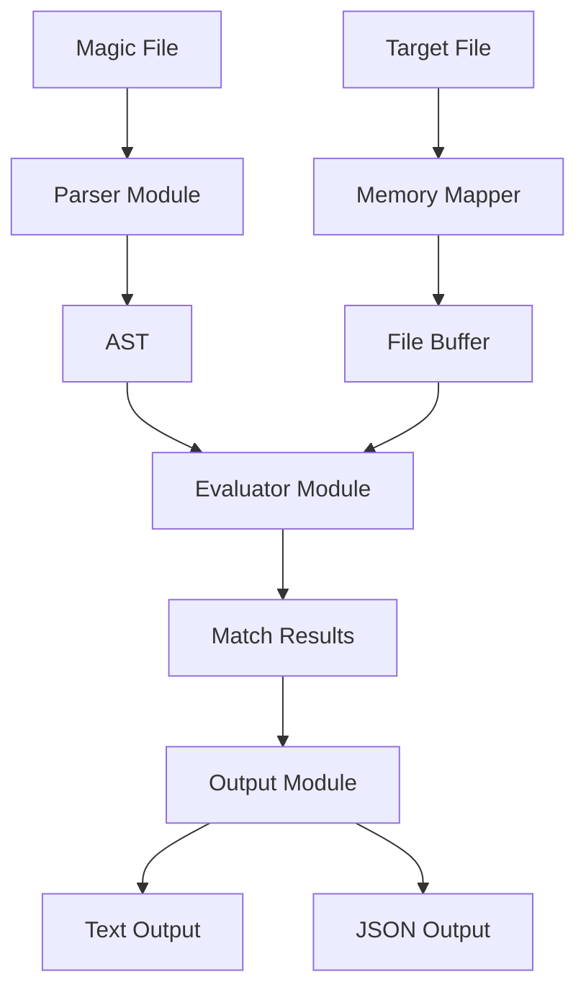

# Design Document

## Overview

This document outlines the design for a pure-Rust implementation of libmagic that provides safe, efficient file type detection through magic rule evaluation. The system follows a parser-evaluator architecture where magic files are parsed into an Abstract Syntax Tree (AST) and then evaluated against file buffers using memory-mapped I/O for optimal performance.

## Architecture

### High-Level Architecture



### Core Design Principles

1. **Memory Safety**: No unsafe code except in vetted dependencies
2. **Performance**: Memory-mapped I/O with zero-copy operations where possible
3. **Modularity**: Clear separation between parsing, evaluation, and output
4. **Extensibility**: AST-based design allows easy addition of new rule types
5. **Compatibility**: Support for common libmagic syntax patterns

## Components and Interfaces

### 1. Parser Module (`src/parser/`)

**Responsibility**: Transform magic file text into structured AST

#### Core Components

- **AST Definitions** (`ast.rs`): Data structures representing magic rules
- **Grammar Parser** (`grammar.rs`): nom-based parser for magic file syntax
- **Parser Interface** (`mod.rs`): Public API for parsing operations

#### Key Data Structures

```rust
#[derive(Debug, Clone, Serialize, Deserialize)]
pub struct MagicRule {
    pub offset: OffsetSpec,
    pub typ: TypeKind,
    pub op: Operator,
    pub value: Value,
    pub message: String,
    pub children: Vec<MagicRule>,
    pub level: u32, // Indentation level for hierarchy
}

#[derive(Debug, Clone, Serialize, Deserialize)]
pub enum OffsetSpec {
    Absolute(i64),
    Indirect {
        base_offset: i64,
        pointer_type: TypeKind,
        adjustment: i64,
        endian: Endianness
    },
    Relative(i64), // Relative to previous match
    FromEnd(i64),  // Negative offset from file end
}

#[derive(Debug, Clone, Serialize, Deserialize)]
pub enum TypeKind {
    Byte,
    Short { endian: Endianness, signed: bool },
    Long { endian: Endianness, signed: bool },
    Quad { endian: Endianness, signed: bool },
    Float { endian: Endianness },
    Double { endian: Endianness },
    String {
        encoding: StringEncoding,
        max_length: Option<usize>,
        flags: StringFlags
    },
    PString { length_type: TypeKind },
    Regex { flags: RegexFlags },
    Date { variant: DateVariant },
}

#[derive(Debug, Clone, Serialize, Deserialize)]
pub enum Operator {
    Equal,
    NotEqual,
    Greater,
    Less,
    GreaterEqual,
    LessEqual,
    BitwiseAnd(u64),
    BitwiseXor(u64),
    BitwiseOr(u64),
    StringMatch,
    RegexMatch,
}
```

#### Parser Implementation Strategy

- Use `nom` parser combinators for robust, composable parsing
- Support hierarchical rule parsing with indentation tracking
- Handle escape sequences and special characters in string literals
- Provide detailed error messages with line numbers and context

### 2. Evaluator Module (`src/evaluator/`)

**Responsibility**: Execute magic rules against file buffers

#### Core Components

- **Offset Resolution** (`offset.rs`): Calculate absolute positions from offset specs
- **Type Interpretation** (`types.rs`): Read and interpret bytes according to type specifications
- **Operator Application** (`operators.rs`): Apply comparison and bitwise operations
- **Evaluation Engine** (`mod.rs`): Coordinate rule matching and hierarchy traversal

#### Key Algorithms

**Offset Resolution**:

```rust
pub fn resolve_offset(
    spec: &OffsetSpec,
    buffer: &[u8],
    context: &EvaluationContext
) -> Result<usize, EvaluationError> {
    match spec {
        OffsetSpec::Absolute(offset) => {
            if *offset < 0 {
                // Handle negative offsets from file end
                let file_len = buffer.len() as i64;
                Ok((file_len + offset) as usize)
            } else {
                Ok(*offset as usize)
            }
        },
        OffsetSpec::Indirect { base_offset, pointer_type, adjustment, endian } => {
            // Read pointer value at base_offset
            let ptr_offset = resolve_absolute_offset(*base_offset, buffer)?;
            let ptr_value = read_typed_value(buffer, ptr_offset, pointer_type, *endian)?;
            Ok((ptr_value as i64 + adjustment) as usize)
        },
        // ... other offset types
    }
}
```

**Type Interpretation**:

```rust
pub fn read_typed_value(
    buffer: &[u8],
    offset: usize,
    typ: &TypeKind
) -> Result<Value, EvaluationError> {
    match typ {
        TypeKind::Byte => {
            buffer.get(offset)
                .map(|&b| Value::Uint(b as u64))
                .ok_or(EvaluationError::BufferOverrun)
        },
        TypeKind::Short { endian, signed } => {
            let bytes = buffer.get(offset..offset+2)
                .ok_or(EvaluationError::BufferOverrun)?;
            let value = match endian {
                Endianness::Little => LittleEndian::read_u16(bytes),
                Endianness::Big => BigEndian::read_u16(bytes),
                Endianness::Native => NativeEndian::read_u16(bytes),
            };
            if *signed {
                Ok(Value::Int(value as i16 as i64))
            } else {
                Ok(Value::Uint(value as u64))
            }
        },
        // ... other types
    }
}
```

#### Evaluation Strategy

- Hierarchical matching: parent rules must match before children are evaluated
- Early termination: stop at first match unless configured for exhaustive matching
- Context preservation: maintain evaluation state for relative offsets and nested rules
- Safe buffer access: all reads protected by bounds checking

### 3. Output Module (`src/output/`)

**Responsibility**: Format evaluation results for different output modes

#### Core Components

- **Text Formatter** (`text.rs`): GNU file-compatible human-readable output
- **JSON Formatter** (`json.rs`): Structured output with metadata
- **Output Coordinator** (`mod.rs`): Format selection and result aggregation

#### Output Formats

**Text Output**:

```
ELF 64-bit LSB executable, x86-64, version 1 (SYSV), dynamically linked
```

**JSON Output** (following original spec format):

```json
{
  "matches": [
    {
      "text": "ELF 64-bit LSB executable",
      "offset": 0,
      "value": "7f454c46",
      "tags": ["executable", "elf"],
      "score": 90
    }
  ]
}
```

**Extended JSON Output** (with additional metadata):

```json
{
  "filename": "example.bin",
  "matches": [
    {
      "text": "ELF 64-bit LSB executable",
      "offset": 0,
      "length": 4,
      "value": "7f454c46",
      "rule_path": ["elf", "elf64", "executable"],
      "tags": ["executable", "elf"],
      "score": 90,
      "mime_type": "application/x-executable"
    }
  ],
  "metadata": {
    "file_size": 8192,
    "evaluation_time_ms": 2.3,
    "rules_evaluated": 45
  }
}
```

**MIME Type Mapping**: Optional database for mapping file type descriptions to MIME types

### 4. CLI Interface (`src/main.rs`)

**Responsibility**: Command-line interface for file type identification

#### CLI Design

```bash
# Basic file identification
rmagic file.bin

# JSON output
rmagic file.bin --json

# Text output (default)
rmagic file.bin --text

# Use custom magic file
rmagic file.bin --magic-file custom.magic

# Multiple files
rmagic file1.bin file2.exe file3.pdf

# Read from stdin
cat file.bin | rmagic --stdin
```

#### CLI Implementation

- Use `clap` for argument parsing with derive macros
- Support batch processing of multiple files
- Configurable output formats (text, JSON, MIME)
- Error handling with appropriate exit codes
- Progress indication for large file batches

### 5. Memory Management (`src/io/`)

**Responsibility**: Efficient file access using memory mapping

#### Implementation

```rust
pub struct FileBuffer {
    mmap: Mmap,
    path: PathBuf,
}

impl FileBuffer {
    pub fn new(path: &Path) -> Result<Self, IoError> {
        let file = File::open(path)?;
        let mmap = unsafe { MmapOptions::new().map(&file)? };
        Ok(FileBuffer {
            mmap,
            path: path.to_path_buf()
        })
    }

    pub fn as_slice(&self) -> &[u8] {
        &self.mmap
    }
}
```

## Data Models

### Core Value Types

```rust
#[derive(Debug, Clone, PartialEq, Serialize, Deserialize)]
pub enum Value {
    Uint(u64),
    Int(i64),
    Float(f64),
    Bytes(Vec<u8>),
    String(String),
    Date(DateTime<Utc>),
}

#[derive(Debug, Clone, Serialize, Deserialize)]
pub struct MatchResult {
    pub message: String,
    pub offset: usize,
    pub length: usize,
    pub value: Value,
    pub rule_path: Vec<String>,
    pub confidence: u8,
    pub mime_type: Option<String>,
}

#[derive(Debug, Clone, Serialize, Deserialize)]
pub struct EvaluationResult {
    pub filename: PathBuf,
    pub matches: Vec<MatchResult>,
    pub metadata: EvaluationMetadata,
}
```

### Configuration and Context

```rust
#[derive(Debug, Clone)]
pub struct EvaluationConfig {
    pub max_recursion_depth: u32,
    pub max_string_length: usize,
    pub stop_at_first_match: bool,
    pub enable_mime_types: bool,
    pub timeout_ms: Option<u64>,
}

#[derive(Debug)]
pub struct EvaluationContext {
    pub current_offset: usize,
    pub recursion_depth: u32,
    pub match_history: Vec<MatchResult>,
    pub config: EvaluationConfig,
}
```

## Error Handling

### Error Types

```rust
#[derive(Debug, thiserror::Error)]
pub enum LibmagicError {
    #[error("Parse error at line {line}: {message}")]
    ParseError { line: usize, message: String },

    #[error("Evaluation error: {0}")]
    EvaluationError(#[from] EvaluationError),

    #[error("IO error: {0}")]
    IoError(#[from] std::io::Error),

    #[error("Invalid magic file format: {0}")]
    InvalidFormat(String),
}

#[derive(Debug, thiserror::Error)]
pub enum EvaluationError {
    #[error("Buffer overrun at offset {offset}")]
    BufferOverrun { offset: usize },

    #[error("Invalid offset specification")]
    InvalidOffset,

    #[error("Unsupported type: {type_name}")]
    UnsupportedType { type_name: String },

    #[error("Recursion depth exceeded")]
    RecursionLimitExceeded,

    #[error("Evaluation timeout")]
    Timeout,
}
```

### Error Recovery Strategy

- **Parse Errors**: Continue parsing after syntax errors, collect all errors for batch reporting
- **Evaluation Errors**: Graceful degradation, skip problematic rules and continue with others
- **IO Errors**: Proper resource cleanup, clear error messages for file access issues
- **Timeout Handling**: Configurable timeouts for long-running evaluations

## Testing Strategy

### Unit Testing

- **Parser Tests**: Verify correct AST generation for various magic file syntaxes
- **Evaluator Tests**: Test offset resolution, type interpretation, and operator application
- **Output Tests**: Validate formatting for both text and JSON outputs
- **Error Tests**: Ensure proper error handling and recovery

### Integration Testing

- **Compatibility Tests**: Compare results with GNU `file` on standard test corpus
- **Performance Tests**: Benchmark against libmagic for common file types
- **Fuzzing Tests**: Use `cargo-fuzz` to test with malformed inputs
- **Memory Tests**: Verify no memory leaks or unsafe operations

### Test Data Organization

```
tests/
├── fixtures/
│   ├── samples/          # Various file types for testing
│   ├── magic/           # Test magic rule files
│   └── expected/        # Expected output files
├── integration/
│   ├── compatibility.rs # GNU file comparison tests
│   ├── performance.rs   # Benchmark tests
│   └── fuzzing.rs      # Fuzz test harness
└── corpus/             # Large test file collection
```

### Performance Benchmarks

- File type detection speed vs. libmagic
- Memory usage patterns with large files
- Startup time with large magic databases
- Throughput for batch file processing

## Implementation Phases

### Phase 1: MVP (v0.1)

- Support absolute offsets only
- Handle `byte`, `short`, `long`, `string` types
- Operators: `=`, `!=`, `&` (bitwise AND)
- Nested rules with hierarchical evaluation
- CLI: `rmagic file --json | --text`
- Basic text output format
- Memory-mapped file reading

### Phase 2: Enhanced Features (v0.2)

- Indirect offset resolution
- Regex support with binary-safe matching (`onig` crate)
- UTF-16 string support
- Compiled binary rule cache for performance
- JSON output format matching original spec
- Additional operators (`>`, `<`, `^` XOR)
- Error recovery and detailed diagnostics

### Phase 3: Performance & Compatibility (v0.3)

- Performance improvements with Aho-Corasick indexing
- PE resources detection
- Mach-O load command strings
- Go build info detection
- Full libmagic syntax compatibility
- Comprehensive test suite and benchmarks
- MIME type mapping database

### Phase 4: Production Ready (v1.0)

- Full subset of libmagic syntax support
- Stable CLI and library API
- Complete documentation with mdbook
- Migration guide from libmagic
- Performance parity validation
- Fuzzing integration and security hardening

### Phase 4: Modern Extensions

- PE resource detection
- Mach-O load command parsing
- Go build info extraction
- Custom rule compilation and caching

## Design Considerations and Solutions

### Binary-Safe Regex Handling

- **Challenge**: Rust's `regex` crate has UTF-8 limitations for binary data
- **Research Finding**: The `regex` crate now supports matching on `&[u8]` for binary data
- **Recommended Solution**:
  - Primary: Use `regex` crate with `bytes` feature for binary-safe matching
  - Fallback: `onig` crate for advanced regex features not supported by `regex`
  - Implementation: Wrapper trait to abstract regex engine choice
- **Code Strategy**:

```rust
pub trait BinaryRegex {
    fn find_at(&self, haystack: &[u8], start: usize) -> Option<Match>;
}

impl BinaryRegex for regex::bytes::Regex { /* ... */ }
impl BinaryRegex for onig::Regex { /* ... */ }
```

### Endianness Complexity

- **Challenge**: Indirect offset resolution requires careful endianness handling
- **Research Finding**: `byteorder` crate provides robust cross-platform endianness handling
- **Recommended Solution**:
  - Use `byteorder` crate with `LittleEndian`, `BigEndian`, and `NativeEndian` types
  - Explicit endianness specification in all multi-byte type definitions
  - Consistent endianness handling in indirect offset calculations
- **Implementation Strategy**:

```rust
use byteorder::{ByteOrder, LittleEndian, BigEndian, NativeEndian};

fn read_with_endianness<T: ByteOrder>(bytes: &[u8]) -> u32 {
    T::read_u32(bytes)
}
```

### Performance Optimization Strategy

- **Research Finding**: `aho-corasick` provides SIMD-accelerated multi-pattern search
- **Recommended Solutions**:
  - **String Indexing**: Use `aho-corasick` for multi-pattern string searches with SIMD acceleration
  - **Binary Caching**: Use `bincode` for fast serialization of compiled rule ASTs
  - **Memory Mapping**: `memmap2` for zero-copy file access
  - **Lazy Evaluation**: Only evaluate child rules when parent matches
- **Performance Targets**: Match or exceed libmagic performance within 10%

### Rule Compilation and Caching

- **Research Finding**: `bincode` is fastest for binary serialization, `serde` provides flexibility
- **Recommended Implementation**:
  - Cache format: `bincode` serialized AST with metadata
  - Cache validation: Compare source file timestamps and checksums
  - Cache location: `~/.cache/rmagic/` or `$XDG_CACHE_HOME/rmagic/`
  - Fallback: Graceful degradation to parsing if cache is invalid
- **Cache Structure**:

```rust
#[derive(Serialize, Deserialize)]
struct CachedRules {
    version: String,
    source_hash: u64,
    timestamp: SystemTime,
    rules: Vec<MagicRule>,
}
```

### Memory Safety and Error Handling

- **Bounds Checking**: All buffer access through safe slice operations with `.get()` methods
- **Resource Management**: RAII patterns for file handles and memory maps
- **Error Recovery**: Continue evaluation after non-fatal errors, collect diagnostics
- **Fuzzing Integration**: Use `cargo-fuzz` with `libfuzzer-sys` for robustness testing

### Cross-Platform Compatibility

- **File Path Handling**: Use `std::path::Path` and `PathBuf` for platform-agnostic paths
- **Line Endings**: Handle both Unix (`\n`) and Windows (`\r\n`) line endings in magic files
- **Architecture Differences**: Test on both little-endian (x86) and big-endian (some ARM) systems
- **Testing Strategy**: CI pipeline with multiple platforms (Linux, macOS, Windows)

### Extensibility Architecture

- **Plugin System**: Trait-based architecture for custom rule types
- **Modern File Formats**: Dedicated modules for PE, Mach-O, ELF analysis
- **Rule DSL Extensions**: Parser designed to handle new syntax additions
- **API Stability**: Semantic versioning with clear deprecation policies

This design provides a solid foundation for implementing a safe, efficient, and extensible pure-Rust replacement for libmagic while maintaining compatibility with existing magic file formats and addressing the key challenges identified in the original specification.
