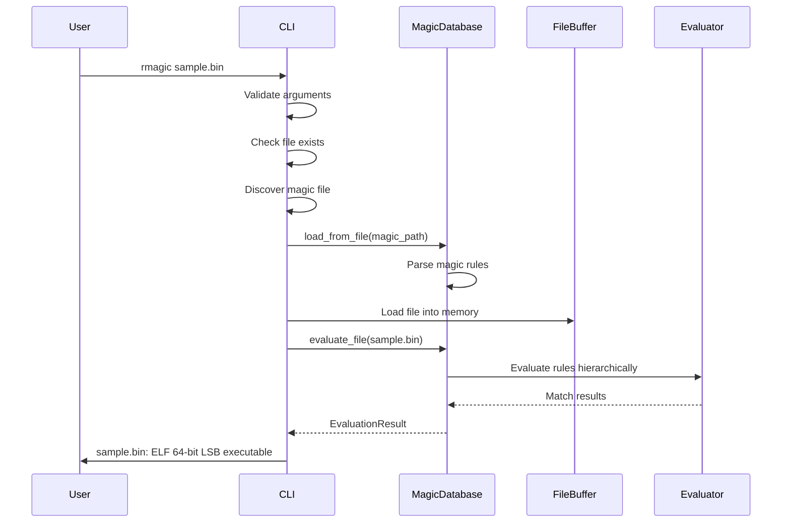
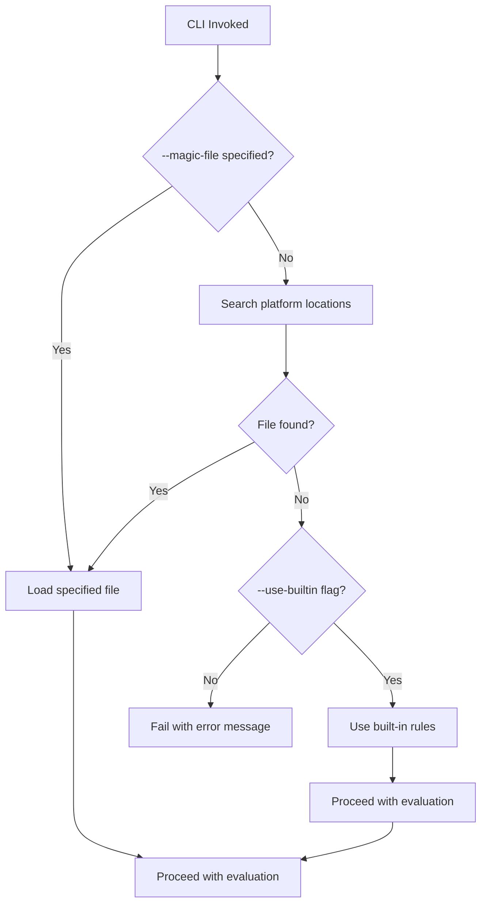

# Core Flows: libmagic-rs Phase 1 MVP

## Overview

This document defines the core user flows for libmagic-rs Phase 1 MVP, covering command-line usage, library API integration, and magic file discovery. These flows represent the primary interaction patterns for both CLI users and library consumers.

## Flow 1: CLI Single File Identification

**Description**: Basic file type identification using the command-line interface

**Trigger**: User runs command with a single file argument

**Steps**:

1. User invokes CLI with file path: `rmagic sample.bin`
2. System validates file exists and is accessible
3. System discovers magic file using platform-specific search paths
4. System loads magic rules from discovered file
5. System evaluates file against magic rules using hierarchical matching
6. System outputs result in text format: `sample.bin: ELF 64-bit LSB executable`
7. System exits with code 0 on success

**Output Format**:

- Text (default): `filename: description`
- JSON (with `--json`): Single JSON object with metadata

**Error Handling**:

- File not found: User-friendly error message, exit code 3
- Permission denied: Clear message about permissions, exit code 3
- Magic file missing: Error with suggestion to use `--use-builtin`, exit code 4



---

## Flow 2: CLI Multiple File Identification

**Description**: Batch file type identification for multiple files

**Trigger**: User runs command with multiple file arguments

**Steps**:

1. User invokes CLI with multiple files: `rmagic file1.bin file2.exe file3.pdf`
2. System validates each file path
3. System discovers and loads magic file once (shared across all files)
4. For each file in sequence:

- Load file into memory
- Evaluate against magic rules
- Output result immediately
- Continue to next file even if current file fails

5. System exits with code 0 (default behavior, GNU file compatible) or non-zero if any failed (with --strict flag)

**Output Format**:

- Text mode: One result per line

  ```text
  file1.bin: ELF 64-bit LSB executable
  file2.exe: PE32 executable
  file3.pdf: PDF document, version 1.4
  ```

- JSON mode: JSON Lines format (one object per line for streaming)

  ```json
  {"filename":"file1.bin","matches":[...],"metadata":{...}}
  {"filename":"file2.exe","matches":[...],"metadata":{...}}
  {"filename":"file3.pdf","matches":[...],"metadata":{...}}
  ```

**Error Handling**:

- Individual file errors: Show error for failed file, continue processing others
- Error format: `file2.exe: Error: Permission denied`
- Exit code behavior:
  - **Default**: Exit 0 even if some files fail (GNU file compatible)
  - **With --strict**: Exit non-zero if any file fails
- Timeout handling: Per-file timeout - each file gets full timeout duration, continue on timeout

---

## Flow 3: Magic File Discovery and Fallback

**Description**: System discovers magic files or uses fallback options

**Trigger**: CLI invocation without explicit `--magic-file` argument

**Steps**:

1. System searches platform-specific locations in order (text-first, OpenBSD approach):

- Unix: `/usr/share/file/magic/Magdir/` (directory), `/usr/share/misc/magic` (text file), `/usr/local/share/misc/magic` (text file)
- Windows: `%APPDATA%\Magic\magic`, fallback to bundled file

2. If magic file found: Load and proceed with evaluation
3. If no magic file found: Fail with error message suggesting options
4. User can retry with explicit flags:

- `--use-builtin`: Use built-in fallback rules without creating files
- `--magic-file <path>`: Specify custom magic file location

**Fallback Behavior**:

- Default: Fail with helpful error message
- With `--use-builtin`: Use embedded rules for common file types (ELF, PE, ZIP, JPEG, PNG, PDF, GIF)

**Error Messages**:

```text
Error: Magic file not found
No magic file found at standard locations.

Options:
  --use-builtin       Use built-in rules (limited file type support)
  --magic-file PATH   Specify a custom magic file location

Example: rmagic --use-builtin sample.bin
```



---

## Flow 4: Library API - Simple Usage

**Description**: Basic library integration for straightforward use cases

**Trigger**: Developer needs file type detection in their Rust application

**Steps**:

1. Developer adds dependency: `libmagic-rs = "0.1"`
2. Developer imports library: `use libmagic_rs::MagicDatabase;`
3. Developer loads magic database: `let db = MagicDatabase::load_from_file("magic.db")?;`

- `load_from_file()` is a convenience method using default `EvaluationConfig`

4. Developer evaluates file or buffer:

- `let result = db.evaluate_file("sample.bin")?;` for files
- `let result = db.evaluate_buffer(&buffer)?;` for byte buffers

5. Developer accesses result: `println!("Type: {}", result.description);`

**API Example**:

```rust
use libmagic_rs::MagicDatabase;

// Simple usage with default configuration
let db = MagicDatabase::load_from_file("/usr/share/misc/magic")?;

// Evaluate file
let result = db.evaluate_file("sample.bin")?;
println!("File type: {}", result.description);
println!("Confidence: {}", result.confidence);

// Or evaluate buffer
let buffer = std::fs::read("sample.bin")?;
let result = db.evaluate_buffer(&buffer)?;
if let Some(mime) = result.mime_type {
    println!("MIME type: {}", mime);
}
```

**Error Handling**:

- Technical error messages with full context
- Structured error types for programmatic handling
- Errors include file paths, line numbers, and diagnostic information

---

## Flow 5: Library API - Advanced Usage with Builder

**Description**: Advanced library integration with custom configuration

**Trigger**: Developer needs fine-grained control over evaluation behavior

**Steps**:

1. Developer creates custom configuration
2. Developer uses builder pattern to configure database
3. Developer evaluates files or buffers with custom settings
4. Developer handles results with full metadata

**API Example**:

```rust
use libmagic_rs::{MagicDatabase, EvaluationConfig};

// Advanced usage with custom configuration
let config = EvaluationConfig {
    max_recursion_depth: 30,
    max_string_length: 16384,
    stop_at_first_match: false,  // Get all matches
    enable_mime_types: true,
    timeout_ms: Some(5000),
};

let db = MagicDatabase::new()
  .with_config(config)?
  .load("/usr/share/file/magic/Magdir/")?;

// Evaluate file
let result = db.evaluate_file("sample.bin")?;

// Or evaluate buffer directly
let buffer = std::fs::read("sample.bin")?;
let result = db.evaluate_buffer(&buffer)?;
```

**Configuration Validation**:

- Validation occurs when config is applied via `with_config()`
- `with_config()` returns an error immediately if values are invalid (e.g., zero recursion depth, excessive limits)
- `validate()` remains available for optional preflight checks

**Configuration Options**:

- `max_recursion_depth`: Limit nested rule evaluation
- `max_string_length`: Limit string reading for safety
- `stop_at_first_match`: Performance vs. completeness trade-off
- `enable_mime_types`: Include MIME type mapping
- `timeout_ms`: Prevent long-running evaluations

---

## Flow 6: Public Evaluation APIs

**Description**: Separate public methods for file and buffer evaluation

**Trigger**: Developer needs to evaluate files or in-memory buffers

**Public API Methods**:

1. `evaluate_file(path)` - Evaluates a file from filesystem
2. `evaluate_buffer(buffer)` - Evaluates in-memory byte buffer

**Internal Implementation**:

- Both methods use internal unified `evaluate()` function
- Internal function handles source type detection and routing
- Consistent result structure regardless of source

**API Design**:

```rust
// Public APIs
impl MagicDatabase {
    pub fn evaluate_file<P: AsRef<Path>>(&self, path: P) -> Result<EvaluationResult> {
        // Load file via memory-mapped I/O
        // Call internal evaluate()
    }

    pub fn evaluate_buffer(&self, buffer: &[u8]) -> Result<EvaluationResult> {
        // Use buffer directly
        // Call internal evaluate()
    }
}

// Usage
let result1 = db.evaluate_file("sample.bin")?;     // File path
let result2 = db.evaluate_buffer(&buffer)?;         // Byte buffer
```

**Benefits**:

- Clear, explicit API for different use cases
- Type-safe source handling
- Consistent error handling across source types
- Memory-efficient for both files and buffers

---

## Flow 7: Error Communication Patterns

**Description**: How errors are communicated in different contexts

### CLI Error Messages (User-Friendly)

**File Not Found**:

```text
Error: File not found
The specified file does not exist or cannot be accessed.
Please check the file path and try again.

File: sample.bin
```

**Permission Denied**:

```text
Error: Permission denied
You do not have permission to access the specified file.
Please check file permissions or run with appropriate privileges.

File: /root/protected.bin
```

**Magic File Parse Error**:

```text
Error: Magic file parse error
The magic file contains invalid syntax or formatting.
Please check the magic file format or try a different magic file.

File: custom.magic
Line: 42
Issue: Invalid offset specification
```

### Library Error Messages (Technical)

**Structured Error Types**:

```rust
pub enum LibmagicError {
    IoError(std::io::Error),
    ParseError(ParseError),
    EvaluationError(EvaluationError),
    Timeout { timeout_ms: u64 },
}

pub struct ParseError {
    line: usize,
    message: String,
    context: Option<String>,
}
```

**Error Context**:

- Full file paths for debugging
- Line numbers and column positions for parse errors
- Stack traces for evaluation errors
- Timeout duration for timeout errors
- Detailed diagnostic information for troubleshooting

---

## Flow 8: JSON Output with Metadata

**Description**: Structured JSON output for programmatic consumption

**Trigger**: User runs CLI with `--json` flag

**Output Structure**:

```json
{
  "filename": "sample.bin",
  "matches": [
    {
      "text": "ELF 64-bit LSB executable",
      "offset": 0,
      "length": 4,
      "value": "7f454c46",
      "rule_path": ["elf", "elf64", "executable"],
      "tags": ["executable", "elf"],
      "score": 90,
      "mime_type": "application/x-executable"
    }
  ],
  "metadata": {
    "file_size": 8192,
    "evaluation_time_ms": 2.3,
    "rules_evaluated": 45,
    "magic_file": "/usr/share/file/magic/Magdir/"
  }
}
```

**Metadata Fields**:

- `file_size`: Size of analyzed file in bytes
- `evaluation_time_ms`: Time taken for evaluation
- `rules_evaluated`: Number of rules checked
- `magic_file`: Path to magic file used (stored in MagicDatabase during loading, None for built-in rules)

**Field Derivation**:

- `tags`: Extracted from file type description using pattern matching for keywords ("executable", "archive", "image", etc.)
- `rule_path`: Derived from hierarchical match messages, normalized to lowercase identifiers (e.g., "ELF" → "64-bit" → "LSB" becomes `["elf", "64-bit", "lsb"]`)
- `score`: Confidence value 0-100, calculated based on match depth in hierarchy
- `mime_type`: Looked up from libmagic's MIME database if available and `enable_mime_types` is true, otherwise None

**Multiple Files (JSON Lines)**:
Each file gets one JSON object per line for streaming:

```json
{"filename":"file1.bin","matches":[...],"metadata":{...}}
{"filename":"file2.exe","matches":[...],"metadata":{...}}
```

---

## Flow 9: Hierarchical Rule Matching

**Description**: How the system evaluates magic rules following libmagic behavior

**Matching Strategy**:

1. Evaluate top-level rules in order
2. When a parent rule matches, evaluate all its children
3. First complete match (parent + children) determines classification
4. Stop at first match unless configured for exhaustive matching

**Example Rule Hierarchy**:

```text
0  string  \x7fELF         ELF
>4 byte    1               32-bit
>4 byte    2               64-bit
>5 byte    1               LSB
>5 byte    2               MSB
```

**Evaluation Flow**:

1. Check offset 0 for "\x7fELF" → Match: "ELF"
2. Check offset 4 for byte value → Match: "64-bit"
3. Check offset 5 for byte value → Match: "LSB"
4. Combine messages: "ELF 64-bit LSB"
5. Return complete match

**Configuration Impact**:

- `stop_at_first_match: true` → Return first complete match
- `stop_at_first_match: false` → Continue evaluating all rules, return all matches

**Parent-Only Matches**:

- If parent rule matches but no children match, behavior follows libmagic exactly
- Typically, parent match alone is valid and returned with parent's message
- Some rules may require child matches - determined by magic file syntax

**Confidence Scoring**:

- Based on match depth in rule hierarchy
- Deeper matches (more specific) get higher confidence scores
- Top-level match: lower confidence (e.g., 0.5 / 50)
- Match with 2+ levels: higher confidence (e.g., 0.9 / 90)
- Exact formula: `confidence = min(1.0, 0.3 + (depth * 0.2))`

**Message Concatenation (libmagic behavior)**:

- When hierarchical rules match, messages are concatenated with spaces
- Example: "ELF" + "64-bit" + "LSB" = "ELF 64-bit LSB"
- If message starts with `\b`, no space is added before it (backspace suppresses space)
- The `description` field contains the complete concatenated message from all matching hierarchical rules
- The `matches` array contains individual MatchResult entries for each level

---

## Key Design Decisions

### Information Hierarchy

- **Primary**: File type description (always shown)
- **Secondary**: Confidence score, MIME type (shown in JSON, optional in text)
- **Tertiary**: Match details, evaluation metadata (JSON only)

### User Journey Integration

- **Entry**: Command invocation or library function call
- **Processing**: Silent operation (no progress indicators for MVP)
- **Exit**: Result output and appropriate exit code

### Placement & Affordances

- **CLI flags**: Standard GNU-style long options (`--json`, `--magic-file`)
- **Library API**: Ergonomic Rust patterns (builder, trait-based evaluation)
- **Error messages**: Contextual help with actionable suggestions

### Feedback & State Communication

- **Success**: Result output with appropriate format
- **Errors**: Clear messages with context and suggestions
- **Progress**: Silent for MVP (defer progress indicators to Phase 2)

## Flow 10: Stdin Input Support

**Description**: Read file data from standard input for pipeline integration

**Trigger**: User runs CLI with `-` as the file argument (using clap-stdin crate with FileOrStdin pattern)

**Steps**:

1. User pipes data to CLI: `cat sample.bin | rmagic -` or `rmagic - < sample.bin`
2. System reads all data from stdin into buffer
3. System discovers and loads magic file (same as file-based flow)
4. System evaluates buffer against magic rules
5. System outputs result with "stdin" as filename
6. System exits with appropriate code

**Output Format**:

- Text: `stdin: ELF 64-bit LSB executable`
- JSON: `{"filename":"stdin","matches":[...],"metadata":{...}}`

**Error Handling**:

- Stdin read error: Clear error message, exit code 1
- Empty stdin: Treat as "data" with warning
- Large stdin: Apply same memory limits as file evaluation

---

## Flow 11: Corrupted Magic File Handling

**Description**: Graceful handling of malformed or corrupted magic files

**Trigger**: Magic file contains syntax errors, encoding issues, or corruption

**Behavior**:

- **Critical Errors**: Fail immediately
  - File I/O errors (unreadable, permission denied)
  - Encoding errors (invalid UTF-8 in text magic file)
  - Completely invalid file format
- **Non-Critical Issues**: Warn and continue
  - Individual rule syntax errors (invalid offset, unknown type, malformed operator)
  - Unknown magic file directives
  - Malformed single rules in otherwise valid file
- **Partial Loading**: Load valid rules, skip invalid ones, report warnings

**Error Messages**:

```text
Warning: Skipped 3 invalid rules in magic file
Line 42: Invalid offset specification
Line 58: Unknown type 'qword'
Line 103: Malformed operator

Loaded 1,247 valid rules from /usr/share/file/magic/Magdir/
```

**Exit Behavior**:

- If any valid rules loaded: Continue with warnings
- If no valid rules loaded: Fail with error suggesting alternative magic file

---

## Flow 12: Evaluation Timeout Handling

**Description**: Handle long-running evaluations that exceed timeout

**Trigger**: Evaluation takes longer than `timeout_ms` configuration value

**Behavior**:

- Return partial results collected before timeout
- Include timeout indicator in result metadata
- Log warning about incomplete evaluation

**CLI Output**:

```
Warning: Evaluation timed out after 5000ms
Partial result: sample.bin: ELF (incomplete analysis)
```

**Library API**:

```rust
// Result includes partial matches
let result = db.evaluate_file("large.bin")?;
if result.metadata.timed_out {
    eprintln!("Warning: Evaluation incomplete due to timeout");
}
```

**JSON Output**:

```json
{
  "filename": "sample.bin",
  "matches": [...],
  "metadata": {
    "timed_out": true,
    "timeout_ms": 5000,
    "partial_results": true
  }
}
```

---

## Related Specifications

- See spec:75a688c2-0ac4-489a-a35d-6e824c94c153/3ce0475b-153d-487f-bc0d-47d0a8f6708a for Epic Brief
- See existing implementation in file:src/main.rs and file:src/lib.rs
