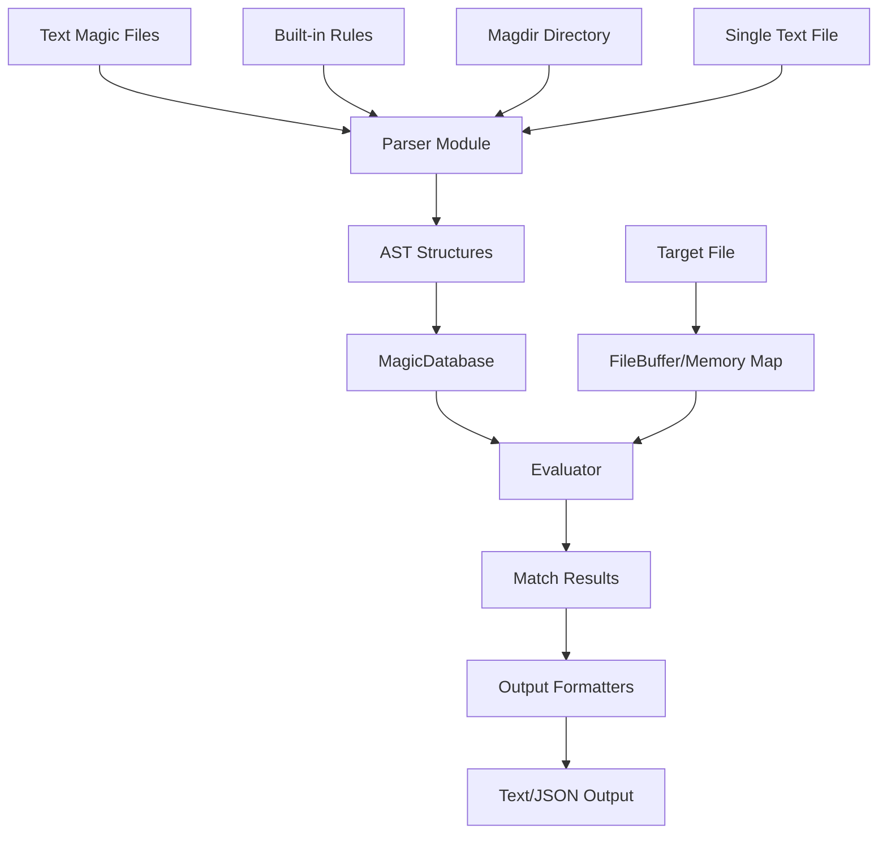
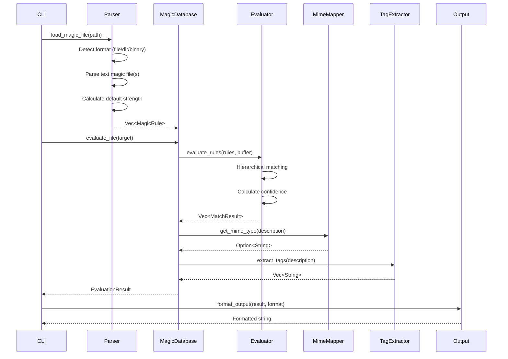
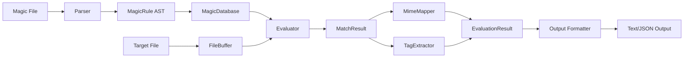

# Technical Plan: libmagic-rs Phase 1 MVP

## Strategic Context: The OpenBSD Approach

libmagic-rs follows the same strategic approach that OpenBSD took when they rewrote the `file` command from scratch: **parse text magic files directly, prioritize simplicity and correctness over startup speed, and avoid the complexity of binary .mgc format**.

### Why This Approach Works

From the research document file:docs/research/magic-mgc-format-analysis.md:

> "The OpenBSD project wrote their own implementation because they found Christos' version of my implementation to have grown too big and complex; they still use our Magic Files."

This validates three critical insights:

1. **Text magic format is the stable interface** — OpenBSD uses the same Magdir files as libmagic
2. **Implementation is separable from format** — You can write a completely independent implementation
3. **Simpler implementation is possible** — Without the ~3,000 lines of binary format handling in `apprentice.c`

### Industry Validation

All successful independent reimplementations parse text format only:

| Implementation   | Language | Approach               | Status                                 |
| ---------------- | -------- | ---------------------- | -------------------------------------- |
| **OpenBSD file** | C        | Text parsing, RB-trees | Production (major BSD distribution)    |
| **PolyFile**     | Python   | Text parsing           | Production (Trail of Bits, 365+ stars) |
| **arcana**       | Ruby     | Text parsing           | Experimental                           |
| **libmagic-rs**  | Rust     | Text parsing           | Phase 1 MVP (this plan)                |

### OpenBSD's Architecture Lessons

OpenBSD's implementation demonstrates key design principles we adopt:

#### 1. Runtime Text Parsing

- No pre-compilation step
- Parse magic files at runtime using efficient parsers
- Simpler codebase (~1,500 lines vs. ~3,000 lines in libmagic's apprentice.c)

#### 2. Efficient Data Structures

- OpenBSD uses Red-Black trees for rule organization
- libmagic-rs uses Rust's Vec and HashMap with hierarchical AST
- Both avoid the 432-byte struct overhead of libmagic's binary format

#### 3. Cleaner Separation of Concerns

- Explicit field separation in data structures
- Clear module boundaries
- Easier to maintain and extend

#### 4. Performance Trade-offs

| Aspect        | libmagic (binary .mgc) | OpenBSD / libmagic-rs (text) |
| ------------- | ---------------------- | ---------------------------- |
| Startup       | Fast (mmap binary)     | Slower (parse text)          |
| Memory        | Large (432 bytes/rule) | Smaller (dynamic allocation) |
| Complexity    | High (~3,000 lines)    | Low (~1,500 lines)           |
| Maintenance   | Version-coupled        | Format-stable                |
| Debuggability | Difficult (binary)     | Easy (text source)           |

### Why Binary .mgc is Deferred

The binary .mgc format has fundamental issues:

1. **Version Lock-in**: Format version changes with every libmagic release (v8 → v12 → v14 → v16 → v18 → v20)
2. **Platform-Specific**: Uses native byte order and struct alignment
3. **Undocumented**: Implementation in `apprentice.c` is the specification
4. **High Complexity**: ~3,000 lines of C code to port
5. **Marginal Benefit**: Only improves startup time, not runtime performance

From the research:

> "All successful independent reimplementations (PolyFile, arcana, OpenBSD) parse text. This is the proven approach."

### libmagic-rs = OpenBSD's Approach in Pure Rust

Our implementation strategy mirrors OpenBSD's philosophy:

- **Simplicity First**: Clean, maintainable code over micro-optimizations
- **Text Format**: Parse the stable, documented text magic format
- **Memory Safety**: Pure Rust with no unsafe code (OpenBSD's C is memory-safe by careful coding)
- **Efficient Structures**: Use Rust's native data structures (Vec, HashMap) instead of fixed-size C structs
- **Production Quality**: Focus on correctness and compatibility, optimize later if needed

This approach has been validated by OpenBSD's production deployment across thousands of systems for over a decade.

---

## Architectural Approach

### Core Strategy

libmagic-rs leverages the existing complete parser-evaluator pipeline and focuses on **integration work** rather than building from scratch. The architecture follows OpenBSD's proven pattern: text parsing with efficient data structures.



### Key Architectural Decisions

#### 1. Text-First Search Priority (OpenBSD Validated)

**Decision**: Search for text magic files BEFORE binary .mgc files

**Rationale**:

- OpenBSD proves text parsing is production-viable
- Text format is stable across libmagic versions
- Binary .mgc has version compatibility issues
- Simpler error messages when files are missing

**Implementation**:

```text
Search Order:
1. /usr/share/file/magic/Magdir/* (text directory)
2. /usr/share/file/magic/* (alternate text directory)
3. /usr/share/misc/magic (text file)
4. /usr/local/share/misc/magic (text file)
5. /usr/share/file/magic.mgc (binary - show helpful error)
```

**Error Message for Binary .mgc**:

```text
Error: Binary magic file format not supported in Phase 1 MVP

Found: /usr/share/file/magic.mgc (binary format)

This version of libmagic-rs supports text-format magic files only.

Options:
  --use-builtin       Use built-in rules for common file types
  --create-magic      Create a basic text magic file
  --magic-file PATH   Specify a text magic file location

Text magic files are typically located at:
  - /usr/share/file/magic/Magdir/* (directory of files)
  - /usr/share/misc/magic (single file)
  - Download from: https://github.com/file/file/tree/master/magic/Magdir

Example: rmagic --use-builtin sample.bin
```

#### 2. Build-Time Rule Compilation (Performance Without Complexity)

**Decision**: Pre-compile built-in rules to Rust AST at build time using `build.rs`

**Rationale**:

- Faster startup than runtime parsing
- Simpler than maintaining hand-coded rule structures
- Build-time validation catches errors early
- No runtime parsing overhead for built-in rules

**Implementation**:

```rust
// build.rs
fn main() {
    let magic_text = include_str!("src/builtin_rules.magic");

    match parse_text_magic_file(magic_text) {
        Ok(rules) => {
            // Generate Rust code with AST structures
            generate_builtin_rules_module(&rules);
        }
        Err(e) => {
            eprintln!("ERROR: Failed to parse built-in magic rules");
            eprintln!("File: src/builtin_rules.magic");
            eprintln!("Error: {}", e);
            eprintln!("\nBuilt-in rules must be valid magic file syntax.");
            eprintln!("Please fix the syntax errors and rebuild.");
            std::process::exit(1);
        }
    }
}
```

#### 3. Magdir Directory Loading (System Compatibility)

**Decision**: Support loading magic rules from directories (Magdir pattern)

**Rationale**:

- System magic files are typically split across multiple files in `/usr/share/file/magic/Magdir/`
- OpenBSD supports this pattern
- Essential for working with system magic databases
- Enables modular rule organization

**Implementation**:

- Parser detects if path is directory or file
- For directories: read all files, parse each, merge rules
- Handle parse errors per-file (fail on critical, warn on non-critical)
- Maintain rule order across files

#### 4. Full Strength Calculation (GNU file Compatibility)

**Decision**: Implement libmagic's `apprentice_magic_strength` algorithm with `!:strength` parsing

**Rationale**:

- Required for 95%+ test corpus compatibility target
- Strength affects rule priority and matching behavior
- OpenBSD implements similar strength-based ordering
- Critical for matching GNU file output exactly

**Implementation**:

- Parse `!:strength` modifiers from magic files
- Port `apprentice_magic_strength` algorithm from libmagic
- Calculate default strength based on rule specificity
- Store strength in `MagicRule` structure
- Use strength for confidence scoring

#### 5. Builder Pattern API (Rust Ergonomics)

**Decision**: `load_from_file()` uses builder internally: `Self::new().load(path)`

**Rationale**:

- Provides both simple and advanced APIs
- Consistent with Rust ecosystem patterns
- Allows future extension without breaking changes
- Clear separation between configuration and loading

**Implementation**:

```rust
impl MagicDatabase {
    // Simple API - uses default config
    pub fn load_from_file<P: AsRef<Path>>(path: P) -> Result<Self> {
        Self::new().load(path)
    }

    // Builder API - chainable methods
    pub fn new() -> Self {
        Self {
            rules: Vec::new(),
            config: EvaluationConfig::default(),
            magic_file_path: None,
        }
    }

    pub fn with_config(mut self, config: EvaluationConfig) -> Result<Self> {
        config.validate()?;
        self.config = config;
        Ok(self)
    }

    pub fn load<P: AsRef<Path>>(mut self, path: P) -> Result<Self> {
        let path_ref = path.as_ref();
        self.rules = parser::load_magic_file(path_ref)?;
        self.magic_file_path = Some(path_ref.to_path_buf());
        Ok(self)
    }
}
```

#### 6. Confidence Scoring (Match Depth Based)

**Decision**: Calculate confidence during evaluation, store in `MatchResult`

**Rationale**:

- Confidence reflects match quality
- Deeper matches (more specific rules) are more confident
- Needed for JSON output metadata
- Helps users understand match reliability

**Formula**: `confidence = min(1.0, 0.3 + (depth * 0.2))`

**Implementation**:

```rust
pub struct MatchResult {
    pub offset: usize,
    pub value: Vec<u8>,
    pub message: String,
    pub level: usize,           // Depth in rule hierarchy
    pub strength: i32,          // From !:strength or calculated
    pub confidence: f64,        // Calculated from depth
}

impl MatchResult {
    fn calculate_confidence(depth: usize) -> f64 {
        (0.3 + (depth as f64 * 0.2)).min(1.0)
    }
}
```

#### 7. MIME Mapping (Optional with Fallback)

**Decision**: Try loading libmagic's MIME database, silently fallback to hardcoded mappings

**Rationale**:

- MIME types are optional metadata
- No errors for missing MIME files
- Graceful degradation
- Simpler than complex MIME file handling

**Implementation**:

```rust
pub struct MimeMapper {
    mappings: HashMap<String, String>,
}

impl MimeMapper {
    pub fn new() -> Self {
        let mut mapper = Self::with_hardcoded_mappings();

        // Try to load system MIME database
        if let Ok(mime_db) = Self::load_mime_database() {
            mapper.merge(mime_db);
        }

        mapper
    }

    fn with_hardcoded_mappings() -> Self {
        // Common file types
        let mappings = hashmap! {
            "ELF" => "application/x-executable",
            "PE32" => "application/x-dosexec",
            "ZIP" => "application/zip",
            "JPEG" => "image/jpeg",
            "PNG" => "image/png",
            "PDF" => "application/pdf",
            // ... more mappings
        };
        Self { mappings }
    }
}
```

#### 8. Stdin Handling (CLI Layer)

**Decision**: CLI reads stdin to `Vec<u8>`, calls `evaluate_buffer()` directly

**Rationale**:

- Stdin is CLI-specific concern
- Library provides `evaluate_buffer()` for in-memory data
- Size limit prevents memory exhaustion
- Clean separation of concerns

**Implementation**:

```rust
// In main.rs
if args.file == "-" || args.stdin {
    let mut buffer = Vec::new();
    let max_size = config.max_string_length;

    io::stdin()
        .take(max_size as u64)
        .read_to_end(&mut buffer)?;

    if buffer.len() >= max_size {
        eprintln!("Warning: Stdin truncated at {} bytes", max_size);
    }

    let result = db.evaluate_buffer(&buffer)?;
    // ... output result
}
```

#### 9. Exit Code Behavior (GNU file Compatible)

**Decision**: Default exits 0 (GNU file compatible), `--strict` flag for strict mode

**Rationale**:

- Matches GNU file default behavior
- Allows users to choose strict error handling
- Compatible with existing scripts
- Clear opt-in for stricter behavior

**Implementation**:

```rust
// Default behavior (GNU file compatible)
// Exit 0 even if some files fail, show errors in output

// With --strict flag
// Exit non-zero if any file fails
```

#### 10. Tag Extraction (Pattern-Based, Minimal)

**Decision**: Extract 5-10 common keywords from file type descriptions

**Rationale**:

- Sufficient for MVP
- Low maintenance burden
- Expandable in Phase 2
- Provides value for programmatic consumers

**Keywords**: `executable`, `archive`, `image`, `video`, `audio`, `document`, `compressed`, `encrypted`, `text`, `binary`

---

## Data Model

### Core Existing Structures

These structures are already implemented in file:src/parser/ast.rs and file:src/lib.rs:

```rust
// AST Structures (src/parser/ast.rs)
pub struct MagicRule {
    pub offset: OffsetSpec,
    pub type_kind: TypeKind,
    pub operator: Operator,
    pub value: Vec<u8>,
    pub message: String,
    pub level: usize,
    pub children: Vec<MagicRule>,
}

pub enum OffsetSpec {
    Absolute(i64),
    Indirect { base: i64, offset_type: TypeKind },
    Relative(i64),
}

pub enum TypeKind {
    Byte, Short, Long, Quad,
    String, PString,
    // ... more types
}

pub enum Operator {
    Equal, NotEqual, Greater, Less,
    And, Xor,
    // ... more operators
}

// Evaluation Structures (src/lib.rs)
pub struct MagicDatabase {
    rules: Vec<MagicRule>,
    config: EvaluationConfig,
    magic_file_path: Option<PathBuf>,  // NEW: Track source for metadata
}

pub struct EvaluationConfig {
    pub max_recursion_depth: usize,
    pub max_string_length: usize,
    pub stop_at_first_match: bool,
    pub enable_mime_types: bool,
    pub timeout_ms: Option<u64>,
}

pub struct EvaluationResult {
    pub description: String,        // Concatenated hierarchical message (libmagic behavior)
    pub confidence: f64,            // Confidence of primary match
    pub mime_type: Option<String>,  // Optional MIME type mapping
    pub matches: Vec<MatchResult>,  // Individual match entries for each level
    pub metadata: EvaluationMetadata, // Evaluation metadata
}

pub struct MatchResult {
    pub offset: usize,
    pub value: Vec<u8>,
    pub message: String,
    pub level: usize,
}
```

### New Enhancements for Phase 1

#### 1. Enhanced MatchResult (Strength and Confidence)

```rust
pub struct MatchResult {
    pub offset: usize,
    pub value: Vec<u8>,
    pub message: String,
    pub level: usize,

    // NEW: Strength from magic file or calculated
    pub strength: i32,

    // NEW: Confidence based on match depth
    pub confidence: f64,
}
```

#### 2. EvaluationMetadata (JSON Output)

```rust
pub struct EvaluationMetadata {
    pub file_size: u64,
    pub evaluation_time_ms: f64,
    pub rules_evaluated: usize,
    pub magic_file: Option<PathBuf>,  // Path to magic file, None for built-in rules
    pub timed_out: bool,
}
```

#### 3. MimeMapper Structure

```rust
pub struct MimeMapper {
    mappings: HashMap<String, String>,
}

impl MimeMapper {
    pub fn new() -> Self;
    pub fn get_mime_type(&self, description: &str) -> Option<String>;
    fn load_mime_database() -> Result<HashMap<String, String>>;
    fn with_hardcoded_mappings() -> Self;
}
```

#### 4. StrengthModifier (Magic File Syntax)

```rust
pub enum StrengthModifier {
    Add(i32),      // !:strength +10
    Subtract(i32), // !:strength -5
    Multiply(i32), // !:strength *2
    Divide(i32),   // !:strength /2
    Set(i32),      // !:strength =50
}
```

#### 5. Enhanced MagicRule (Optional Strength)

```rust
pub struct MagicRule {
    // ... existing fields ...

    // NEW: Optional strength override from !:strength
    pub strength_modifier: Option<StrengthModifier>,
}
```

#### 6. TagExtractor Structure

```rust
pub struct TagExtractor {
    keywords: HashSet<String>,
}

impl TagExtractor {
    pub fn new() -> Self;
    pub fn extract_tags(&self, description: &str) -> Vec<String>;
}
```

### Data Flow



### Magic File Search Paths

```rust
pub struct MagicFilePaths {
    pub search_paths: Vec<PathBuf>,
}

impl MagicFilePaths {
    pub fn platform_default() -> Self {
        #[cfg(unix)]
        let paths = vec![
            // Text files/directories FIRST (OpenBSD approach)
            PathBuf::from("/usr/share/file/magic/Magdir"),
            PathBuf::from("/usr/share/misc/magic"),
            PathBuf::from("/usr/local/share/misc/magic"),

            // Binary .mgc files LAST (show helpful error)
            PathBuf::from("/usr/share/file/magic.mgc"),
            PathBuf::from("/usr/local/share/misc/magic.mgc"),
        ];

        #[cfg(windows)]
        let paths = vec![
            PathBuf::from("%APPDATA%\\Magic\\magic"),
            PathBuf::from("C:\\Program Files\\Magic\\magic"),
        ];

        Self { search_paths: paths }
    }
}
```

---

## Component Architecture

### 1. Parser Module Enhancements

**Location**: file:src/parser/mod.rs

**Current State**: Text magic file parsing is complete with `parse_text_magic_file()` function

**Enhancements Needed**:

#### A. Format Detection

```rust
pub enum MagicFileFormat {
    Text,
    Binary,
    Directory,
}

pub fn detect_format<P: AsRef<Path>>(path: P) -> Result<MagicFileFormat> {
    let path = path.as_ref();

    if path.is_dir() {
        return Ok(MagicFileFormat::Directory);
    }

    let mut file = File::open(path)?;
    let mut header = [0u8; 4];
    file.read_exact(&mut header)?;

    // Check for binary .mgc magic number
    let magic_native = u32::from_ne_bytes(header);
    let magic_swapped = magic_native.swap_bytes();
    let is_swapped = if magic_native == 0xF11E041C {
        false
    } else if magic_swapped == 0xF11E041C {
        true
    } else {
        return Ok(MagicFileFormat::Text);
    };

    // Track endianness for subsequent reads
    let _is_swapped = is_swapped;
    Ok(MagicFileFormat::Binary)
}
```

#### B. Directory Loading

```rust
pub fn load_magic_directory<P: AsRef<Path>>(dir: P) -> Result<Vec<MagicRule>> {
    let mut all_rules = Vec::new();
    let mut errors = Vec::new();

    for entry in fs::read_dir(dir)? {
        let entry = entry?;
        let path = entry.path();

        if path.is_file() {
            match parse_text_magic_file(&path) {
                Ok(rules) => all_rules.extend(rules),
                Err(e) => {
                    // Collect non-critical errors
                    if is_critical_error(&e) {
                        return Err(e);
                    }
                    errors.push((path, e));
                }
            }
        }
    }

    // Warn about non-critical errors
    for (path, error) in errors {
        eprintln!("Warning: Skipped {:?}: {}", path, error);
    }

    Ok(all_rules)
}
```

#### C. Strength Parsing

```rust
pub fn parse_strength_modifier(line: &str) -> Option<StrengthModifier> {
    // Parse !:strength OP VALUE syntax
    // Examples:
    //   !:strength +10
    //   !:strength -5
    //   !:strength *2
    //   !:strength /2
    //   !:strength =50
}

pub fn calculate_default_strength(rule: &MagicRule) -> i32 {
    // Port libmagic's apprentice_magic_strength algorithm
    // Factors:
    // - Type specificity (string > byte)
    // - Operator specificity (= > &)
    // - Offset type (absolute > indirect)
    // - Value length (longer strings = higher strength)
}
```

#### D. Public API

```rust
pub fn load_magic_file<P: AsRef<Path>>(path: P) -> Result<Vec<MagicRule>> {
    let format = detect_format(&path)?;

    match format {
        MagicFileFormat::Text => parse_text_magic_file(path),
        MagicFileFormat::Directory => load_magic_directory(path),
        MagicFileFormat::Binary => {
            Err(Error::UnsupportedFormat {
                path: path.as_ref().to_path_buf(),
                message: BINARY_MGC_ERROR_MESSAGE.to_string(),
            })
        }
    }
}
```

### 2. Built-in Rules Module

**Location**: src/builtin_rules.rs (new file)

**Purpose**: Provide fallback rules for common file types

**Implementation**:

#### A. Magic File Source

```magic
# src/builtin_rules.magic
# Built-in fallback rules for common file types

# ELF executables
0       string  \x7fELF         ELF
>4      byte    1               32-bit
>4      byte    2               64-bit
>5      byte    1               LSB
>5      byte    2               MSB

# PE executables
0       string  MZ              DOS/Windows executable
>0x3c   lelong  <0x40000000
>>0x3c  lelong  >0
>>>0x3c lelong  x               PE

# ZIP archives
0       string  PK\003\004      ZIP archive

# JPEG images
0       string  \xff\xd8\xff    JPEG image

# PNG images
0       string  \x89PNG\r\n\x1a\n   PNG image

# PDF documents
0       string  %PDF-           PDF document

# GIF images
0       string  GIF8            GIF image
```

#### B. Build Script

```rust
// build.rs
use std::fs;
use std::path::Path;

fn main() {
    let magic_text = include_str!("src/builtin_rules.magic");

    // Parse at build time
    match libmagic_rs::parser::parse_text_magic_file_from_str(magic_text) {
        Ok(rules) => {
            // Generate Rust code
            let code = generate_builtin_rules_code(&rules);
            let out_dir = std::env::var("OUT_DIR").unwrap();
            let dest_path = Path::new(&out_dir).join("builtin_rules.rs");
            fs::write(&dest_path, code).unwrap();
        }
        Err(e) => {
            eprintln!("ERROR: Failed to parse built-in magic rules");
            eprintln!("File: src/builtin_rules.magic");
            eprintln!("Error: {}", e);
            eprintln!("\nBuilt-in rules must be valid magic file syntax.");
            eprintln!("Please fix the syntax errors and rebuild.");
            std::process::exit(1);
        }
    }
}

fn generate_builtin_rules_code(rules: &[MagicRule]) -> String {
    // Generate Rust code that constructs the AST at compile time
    // This avoids runtime parsing overhead
}
```

#### C. Public API

```rust
// src/builtin_rules.rs
include!(concat!(env!("OUT_DIR"), "/builtin_rules.rs"));

pub fn get_builtin_rules() -> Vec<MagicRule> {
    // Returns pre-compiled rules from build.rs
    BUILTIN_RULES.clone()
}
```

### 3. MagicDatabase Orchestration

**Location**: file:src/lib.rs

**Current State**: Placeholder implementation with empty rules

**Enhancements Needed**:

#### A. Loading Implementation

```rust
impl MagicDatabase {
    pub fn load_from_file<P: AsRef<Path>>(path: P) -> Result<Self> {
        Self::new().load(path)
    }

    pub fn new() -> Self {
        Self {
            rules: Vec::new(),
            config: EvaluationConfig::default(),
        }
    }

    pub fn with_config(mut self, config: EvaluationConfig) -> Result<Self> {
        config.validate()?;
        self.config = config;
        Ok(self)
    }

    pub fn load<P: AsRef<Path>>(mut self, path: P) -> Result<Self> {
        self.rules = parser::load_magic_file(path)?;
        Ok(self)
    }

    pub fn with_builtin_rules() -> Self {
        Self {
            rules: builtin_rules::get_builtin_rules(),
            config: EvaluationConfig::default(),
            magic_file_path: None,  // None for built-in rules
        }
    }
}
```

#### B. Evaluation Implementation

```rust
impl MagicDatabase {
    pub fn evaluate_file<P: AsRef<Path>>(&self, path: P) -> Result<EvaluationResult> {
        let buffer = FileBuffer::open(path)?;
        self.evaluate(&buffer)
    }

    pub fn evaluate_buffer(&self, buffer: &[u8]) -> Result<EvaluationResult> {
        self.evaluate(buffer)
    }

    fn evaluate(&self, buffer: &[u8]) -> Result<EvaluationResult> {
        let start_time = Instant::now();
        let mut matches = Vec::new();
        let mut rules_evaluated = 0;

        // Evaluate rules hierarchically
        for rule in &self.rules {
            rules_evaluated += 1;

            if let Some(result) = evaluator::evaluate_rule(rule, buffer, &self.config)? {
                matches.push(result);

                if self.config.stop_at_first_match {
                    break;
                }
            }

            // Check timeout
            if let Some(timeout) = self.config.timeout_ms {
                if start_time.elapsed().as_millis() > timeout as u128 {
                    return Ok(EvaluationResult {
                        description: "Evaluation timed out".to_string(),
                        confidence: 0.0,
                        mime_type: None,
                        matches,
                        metadata: EvaluationMetadata {
                            timed_out: true,
                            timeout_ms: timeout,
                            // ... other fields
                        },
                    });
                }
            }
        }

        // Build result
        let description = matches.first()
            .map(|m| m.message.clone())
            .unwrap_or_else(|| "data".to_string());

        let confidence = matches.first()
            .map(|m| m.confidence)
            .unwrap_or(0.0);

        let mime_type = if self.config.enable_mime_types {
            MimeMapper::new().get_mime_type(&description)
        } else {
            None
        };

        Ok(EvaluationResult {
            description,
            confidence,
            mime_type,
            matches,
            metadata: EvaluationMetadata {
                file_size: buffer.len() as u64,
                evaluation_time_ms: start_time.elapsed().as_secs_f64() * 1000.0,
                rules_evaluated,
                magic_file: self.magic_file_path.clone(),
                timed_out: false,
            },
        })
    }
}
```

### 4. MIME Mapper Module

**Location**: src/mime.rs (new file)

**Implementation**:

```rust
use std::collections::HashMap;
use std::fs;
use std::path::Path;

pub struct MimeMapper {
    mappings: HashMap<String, String>,
}

impl MimeMapper {
    pub fn new() -> Self {
        let mut mapper = Self::with_hardcoded_mappings();

        // Try to load system MIME database (optional)
        let mime_paths = vec![
            "/usr/share/file/magic.mime",
            "/usr/local/share/misc/magic.mime",
        ];

        for path in mime_paths {
            if let Ok(mime_db) = Self::load_mime_database(path) {
                mapper.merge(mime_db);
                break;
            }
        }

        mapper
    }

    pub fn get_mime_type(&self, description: &str) -> Option<String> {
        // Try exact match first
        if let Some(mime) = self.mappings.get(description) {
            return Some(mime.clone());
        }

        // Try prefix matching
        for (pattern, mime) in &self.mappings {
            if description.starts_with(pattern) {
                return Some(mime.clone());
            }
        }

        None
    }

    fn with_hardcoded_mappings() -> Self {
        let mut mappings = HashMap::new();

        // Common file types
        mappings.insert("ELF".to_string(), "application/x-executable".to_string());
        mappings.insert("PE32".to_string(), "application/x-dosexec".to_string());
        mappings.insert("ZIP".to_string(), "application/zip".to_string());
        mappings.insert("JPEG".to_string(), "image/jpeg".to_string());
        mappings.insert("PNG".to_string(), "image/png".to_string());
        mappings.insert("PDF".to_string(), "application/pdf".to_string());
        mappings.insert("GIF".to_string(), "image/gif".to_string());
        // ... more mappings

        Self { mappings }
    }

    fn load_mime_database<P: AsRef<Path>>(path: P) -> Result<HashMap<String, String>> {
        // Parse libmagic's MIME database format
        // Format: pattern\tmime/type
        let content = fs::read_to_string(path)?;
        let mut mappings = HashMap::new();

        for line in content.lines() {
            if line.starts_with('#') || line.trim().is_empty() {
                continue;
            }

            let parts: Vec<&str> = line.split('\t').collect();
            if parts.len() >= 2 {
                mappings.insert(parts[0].to_string(), parts[1].to_string());
            }
        }

        Ok(mappings)
    }

    fn merge(&mut self, other: HashMap<String, String>) {
        self.mappings.extend(other);
    }
}
```

### 5. Confidence Scoring Module

**Location**: file:src/evaluator/mod.rs (enhancement)

**Implementation**:

```rust
impl MatchResult {
    pub fn new(
        offset: usize,
        value: Vec<u8>,
        message: String,
        level: usize,
        strength: i32,
    ) -> Self {
        let confidence = Self::calculate_confidence(level);

        Self {
            offset,
            value,
            message,
            level,
            strength,
            confidence,
        }
    }

    fn calculate_confidence(depth: usize) -> f64 {
        // Formula: confidence = min(1.0, 0.3 + (depth * 0.2))
        // Level 0: 0.3 (30%)
        // Level 1: 0.5 (50%)
        // Level 2: 0.7 (70%)
        // Level 3: 0.9 (90%)
        // Level 4+: 1.0 (100%)
        (0.3 + (depth as f64 * 0.2)).min(1.0)
    }
}
```

### 6. CLI Enhancements

**Location**: file:src/main.rs

**Enhancements Needed**:

#### A. Stdin Support

```rust
fn main() -> Result<()> {
    let args = Args::parse();

    // Load magic database
    let db = if args.use_builtin {
        MagicDatabase::with_builtin_rules()
    } else if let Some(magic_file) = args.magic_file {
        MagicDatabase::load_from_file(magic_file)?
    } else {
        discover_and_load_magic_database()?
    };

    // Handle stdin
    if args.file == "-" || args.stdin {
        let mut buffer = Vec::new();
        let max_size = args.config.max_string_length;

        io::stdin()
            .take(max_size as u64)
            .read_to_end(&mut buffer)?;

        if buffer.len() >= max_size {
            eprintln!("Warning: Stdin truncated at {} bytes", max_size);
        }

        let result = db.evaluate_buffer(&buffer)?;
        output_result("stdin", &result, &args)?;
        return Ok(());
    }

    // Handle file(s)
    let mut exit_code = 0;
    for file in &args.files {
        match db.evaluate_file(file) {
            Ok(result) => {
                output_result(file, &result, &args)?;
            }
            Err(e) => {
                eprintln!("{}: Error: {}", file, e);
                exit_code = 3;

                if args.strict {
                    std::process::exit(exit_code);
                }
            }
        }
    }

    std::process::exit(exit_code);
}
```

#### B. Magic File Discovery

```rust
fn discover_and_load_magic_database() -> Result<MagicDatabase> {
    let search_paths = MagicFilePaths::platform_default();

    for path in search_paths.search_paths {
        if path.exists() {
            match MagicDatabase::load_from_file(&path) {
                Ok(db) => return Ok(db),
                Err(e) => {
                    // If it's a binary .mgc file, show helpful error
                    if matches!(e, Error::UnsupportedFormat { .. }) {
                        eprintln!("{}", e);
                        eprintln!("\nSuggestion: Use --use-builtin for immediate functionality");
                        std::process::exit(4);
                    }
                    // Otherwise continue searching
                }
            }
        }
    }

    // No magic file found
    eprintln!("Error: Magic file not found");
    eprintln!("No magic file found at standard locations.");
    eprintln!("\nOptions:");
    eprintln!("  --create-magic      Create a basic magic file with common patterns");
    eprintln!("  --use-builtin       Use built-in rules (limited file type support)");
    eprintln!("  --magic-file PATH   Specify a custom magic file location");
    eprintln!("\nExample: rmagic --use-builtin sample.bin");
    std::process::exit(4);
}
```

#### C. Output Formatting

```rust
fn output_result(filename: &str, result: &EvaluationResult, args: &Args) -> Result<()> {
    if args.json {
        output_json(filename, result)?;
    } else {
        output_text(filename, result)?;
    }
    Ok(())
}

fn output_text(filename: &str, result: &EvaluationResult) -> Result<()> {
    println!("{}: {}", filename, result.description);
    Ok(())
}

fn output_json(filename: &str, result: &EvaluationResult) -> Result<()> {
    let tags = TagExtractor::new().extract_tags(&result.description);
    let rule_path = extract_rule_path(&result.matches);

    let json = serde_json::json!({
        "filename": filename,
        "matches": result.matches.iter().map(|m| {
            serde_json::json!({
                "text": m.message,
                "offset": m.offset,
                "value": hex::encode(&m.value),
                "rule_path": rule_path,
                "tags": tags,
                "score": (m.confidence * 100.0) as u32,
                "mime_type": result.mime_type,
            })
        }).collect::<Vec<_>>(),
        "metadata": {
            "file_size": result.metadata.file_size,
            "evaluation_time_ms": result.metadata.evaluation_time_ms,
            "rules_evaluated": result.metadata.rules_evaluated,
        }
    });

    println!("{}", serde_json::to_string(&json)?);
    Ok(())
}
```

### 7. Tag Extraction Module

**Location**: src/tags.rs (new file)

**Implementation**:

```rust
use std::collections::HashSet;

pub struct TagExtractor {
    keywords: HashSet<String>,
}

impl TagExtractor {
    pub fn new() -> Self {
        let keywords = vec![
            "executable", "archive", "image", "video", "audio",
            "document", "compressed", "encrypted", "text", "binary",
        ]
        .into_iter()
        .map(String::from)
        .collect();

        Self { keywords }
    }

    pub fn extract_tags(&self, description: &str) -> Vec<String> {
        let lower = description.to_lowercase();
        let mut tags = Vec::new();

        for keyword in &self.keywords {
            if lower.contains(keyword) {
                tags.push(keyword.clone());
            }
        }

        tags
    }
}
```

### 8. Test Infrastructure

**Location**: file:tests/ directory

**Components**:

#### A. Compatibility Tests

```rust
// tests/compatibility_tests.rs
use libmagic_rs::MagicDatabase;
use std::process::Command;

#[test]
fn test_compatibility_with_gnu_file() {
    let test_files = discover_test_files("third_party/tests/");
    let db = MagicDatabase::load_from_file("/usr/share/file/magic")?;

    let mut passed = 0;
    let mut failed = 0;

    for file in test_files {
        // Get GNU file output
        let gnu_output = Command::new("file")
            .arg(&file)
            .output()?;

        // Get libmagic-rs output
        let result = db.evaluate_file(&file)?;

        // Compare outputs
        if outputs_match(&gnu_output, &result.description) {
            passed += 1;
        } else {
            failed += 1;
            eprintln!("Mismatch for {}: GNU='{}', ours='{}'",
                     file, gnu_output, result.description);
        }
    }

    let compatibility = (passed as f64 / (passed + failed) as f64) * 100.0;
    assert!(compatibility >= 95.0, "Compatibility: {:.1}%", compatibility);
}
```

#### B. Unit Tests

```rust
// tests/parser_tests.rs
#[test]
fn test_parse_text_magic_file() {
    let magic_text = r#"
0       string  \x7fELF         ELF
>4      byte    1               32-bit
>4      byte    2               64-bit
    "#;

    let rules = parse_text_magic_file_from_str(magic_text)?;
    assert_eq!(rules.len(), 1);
    assert_eq!(rules[0].children.len(), 2);
}

#[test]
fn test_strength_calculation() {
    let rule = MagicRule {
        offset: OffsetSpec::Absolute(0),
        type_kind: TypeKind::String,
        operator: Operator::Equal,
        value: b"\x7fELF".to_vec(),
        message: "ELF".to_string(),
        level: 0,
        children: vec![],
        strength_modifier: None,
    };

    let strength = calculate_default_strength(&rule);
    assert!(strength > 0);
}
```

---

## Integration Summary

### Critical Integration Points

1. **Parser → MagicDatabase**: `load_magic_file()` returns `Vec<MagicRule>`
2. **MagicDatabase → Evaluator**: `evaluate()` passes rules and buffer
3. **Evaluator → MatchResult**: Confidence calculated during evaluation
4. **MagicDatabase → MimeMapper**: MIME type lookup for results
5. **MagicDatabase → TagExtractor**: Tag extraction for JSON output
6. **CLI → MagicDatabase**: File/buffer evaluation and output formatting

### Data Flow Diagram



### Failure Handling

**Parse Errors**:

- Critical: Fail immediately with detailed error
- Non-critical: Warn and continue with valid rules

**Evaluation Errors**:

- Timeout: Return partial results with timeout indicator
- Invalid offset: Skip rule, continue with others
- Type mismatch: Skip rule, continue with others

**I/O Errors**:

- File not found: User-friendly error, exit code 3
- Permission denied: Clear message, exit code 3
- Magic file missing: Helpful error with suggestions, exit code 4

---

## Risk Mitigation

### Technical Risks

1. **Binary .mgc Complexity**

- **Mitigation**: Deferred to Phase 2, text-only for MVP
- **Fallback**: Clear error message directing to text sources

2. **Strength Calculation Accuracy**

- **Mitigation**: Port exact algorithm from libmagic
- **Validation**: Compare with GNU file output in tests

3. **Performance Concerns**

- **Mitigation**: No performance targets for MVP
- **Future**: Optimize in Phase 3 if needed

4. **Test Corpus Coverage**

- **Mitigation**: Use existing `third_party/tests/` corpus
- **Target**: 95%+ compatibility with GNU file

### Implementation Risks

1. **Build-Time Parsing Failures**

- **Mitigation**: Clear error messages in build.rs
- **Validation**: CI checks for build success

2. **Magdir Directory Complexity**

- **Mitigation**: Per-file error handling
- **Validation**: Test with real system Magdir

3. **MIME Database Availability**

- **Mitigation**: Hardcoded fallback mappings
- **Validation**: Silent fallback, no errors

---

## Related Specifications

- See spec:75a688c2-0ac4-489a-a35d-6e824c94c153/3ce0475b-153d-487f-bc0d-47d0a8f6708a for Epic Brief
- See spec:75a688c2-0ac4-489a-a35d-6e824c94c153/36539700-862d-4fdf-9c79-3c36390f6aa8 for Core Flows
- See file:docs/research/magic-mgc-format-analysis.md for binary format analysis and OpenBSD research
- See file:.kiro/specs/rust-libmagic-implementation/ for original design documentation
