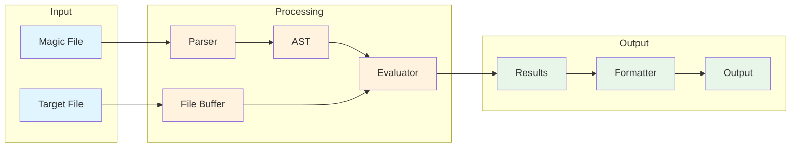
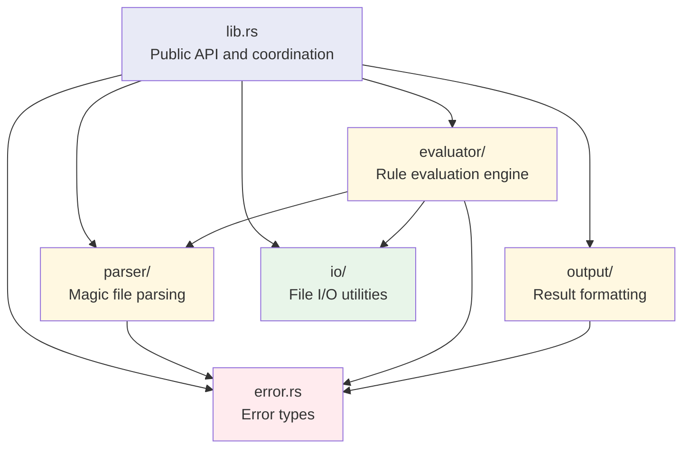

# Architecture Overview

The libmagic-rs library is designed around a clean separation of concerns, following a parser-evaluator architecture that promotes maintainability, testability, and performance.

## High-Level Architecture



## Core Components

### 1. Parser Module (`src/parser/`)

The parser is responsible for converting magic files (text-based DSL) into an Abstract Syntax Tree (AST).

**Key Files:**

- `ast.rs`: Core data structures representing magic rules (✅ Complete)
- `grammar.rs`: nom-based parsing components for magic file syntax (✅ Complete)
- `mod.rs`: Parser interface, format detection, and hierarchical rule building (✅ Complete)

**Responsibilities:**

- Parse magic file syntax into structured data (✅ Complete)
- Handle hierarchical rule relationships (✅ Complete)
- Validate syntax and report meaningful errors (✅ Complete)
- Detect file format (text, directory, binary) (✅ Complete)
- Support incremental parsing for large magic databases (📋 Planned)

**Current Implementation Status:**

- ✅ **Number parsing**: Decimal and hexadecimal with overflow protection
- ✅ **Offset parsing**: Absolute offsets with comprehensive validation
- ✅ **Operator parsing**: Equality (`=`, `==`), inequality (`!=`, `<>`), comparison (`<`, `>`, `<=`, `>=`), and bitwise AND (`&`) operators
- ✅ **Value parsing**: Strings, numbers, and hex byte sequences with escape sequences
- ✅ **Error handling**: Comprehensive nom error handling with meaningful messages
- ✅ **Rule parsing**: Complete rule parsing via `parse_magic_rule()`
- ✅ **File parsing**: Complete magic file parsing with `parse_text_magic_file()`
- ✅ **Hierarchy building**: Parent-child relationships via `build_rule_hierarchy()`
- ✅ **Format detection**: Text, directory, and binary format detection
- 📋 **Indirect offsets**: Pointer dereferencing patterns

### 2. AST Data Structures (`src/parser/ast.rs`)

The AST provides a complete representation of magic rules in memory.

**Core Types:**

```rust
pub struct MagicRule {
    pub offset: OffsetSpec,       // Where to read data
    pub typ: TypeKind,            // How to interpret bytes
    pub op: Operator,             // Comparison operation
    pub value: Value,             // Expected value
    pub message: String,          // Human-readable description
    pub children: Vec<MagicRule>, // Nested rules
    pub level: u32,               // Indentation level
}

pub enum TypeKind {
    Byte { signed: bool },        // Single byte with explicit signedness
    Short { endian: Endianness, signed: bool },
    Long { endian: Endianness, signed: bool },
    Quad { endian: Endianness, signed: bool },
    String { max_length: Option<usize> },
}

pub enum Operator {
    Equal,                        // = or ==
    NotEqual,                     // != or <>
    LessThan,                     // <
    GreaterThan,                  // >
    LessEqual,                    // <=
    GreaterEqual,                 // >=
    BitwiseAnd,                   // &
    BitwiseAndMask(u64),          // & with mask
}
```

**Design Principles:**

- **Immutable by default**: Rules don't change after parsing
- **Serializable**: Full serde support for caching
- **Self-contained**: No external dependencies in AST nodes
- **Type-safe**: Rust's type system prevents invalid rule combinations
- **Explicit signedness**: `TypeKind::Byte` and integer types (Short, Long, Quad) distinguish signed from unsigned interpretations

### 3. Evaluator Module (`src/evaluator/`)

The evaluator executes magic rules against file buffers to identify file types. (✅ Complete)

**Structure:**

- `mod.rs`: Main evaluation engine with `EvaluationContext` and `MatchResult`
- `offset.rs`: Offset resolution (absolute, relative, from-end)
- `types.rs`: Type interpretation with endianness handling and signedness coercion
- `operators.rs`: Comparison and bitwise operations

**Implemented Features:**

- ✅ **Hierarchical Evaluation**: Parent rules must match before children
- ✅ **Lazy Evaluation**: Only process rules when necessary
- ✅ **Bounds Checking**: Safe buffer access with overflow protection
- ✅ **Context Preservation**: Maintain state across rule evaluations
- ✅ **Graceful Degradation**: Skip problematic rules, continue evaluation
- ✅ **Timeout Protection**: Configurable time limits
- ✅ **Recursion Limiting**: Prevent stack overflow from deep nesting
- ✅ **Signedness Coercion**: Automatic value coercion for signed type comparisons (e.g., `0xff` → `-1` for signed byte)
- ✅ **Comparison Operators**: Full support for `<`, `>`, `<=`, `>=` with numeric and lexicographic ordering
- 📋 **Indirect Offsets**: Pointer dereferencing (planned)

### 4. I/O Module (`src/io/`)

Provides efficient file access through memory-mapped I/O. (✅ Complete)

**Implemented Features:**

- **FileBuffer**: Memory-mapped file buffers using `memmap2`
- **Safe buffer access**: Comprehensive bounds checking with `safe_read_bytes` and `safe_read_byte`
- **Error handling**: Structured IoError types for all failure scenarios
- **Resource management**: RAII patterns with automatic cleanup
- **File validation**: Size limits, empty file detection, and metadata validation
- **Overflow protection**: Safe arithmetic in all buffer operations

**Key Components:**

```rust
pub struct FileBuffer {
    mmap: Mmap,
    path: PathBuf,
}

pub fn safe_read_bytes(buffer: &[u8], offset: usize, length: usize) -> Result<&[u8], IoError>
pub fn safe_read_byte(buffer: &[u8], offset: usize) -> Result<u8, IoError>
pub fn validate_buffer_access(buffer_size: usize, offset: usize, length: usize) -> Result<(), IoError>
```

### 5. Output Module (`src/output/`)

Formats evaluation results into different output formats.

**Planned Formatters:**

- `text.rs`: Human-readable output (GNU `file` compatible)
- `json.rs`: Structured JSON output with metadata
- `mod.rs`: Format selection and coordination

## Data Flow

### 1. Magic File Loading


1. **Parsing**: Convert text DSL to structured AST
2. **Validation**: Check rule consistency and dependencies
3. **Optimization**: Reorder rules for evaluation efficiency
4. **Caching**: Serialize compiled rules for reuse

### 2. File Evaluation


1. **File Access**: Create memory-mapped buffer
2. **Rule Matching**: Execute rules hierarchically
3. **Result Collection**: Gather matches and metadata
4. **Output Generation**: Format results as text or JSON

## Design Patterns

### Parser-Evaluator Separation

The clear separation between parsing and evaluation provides:

- **Independent Testing**: Each component can be tested in isolation
- **Performance Optimization**: Rules can be pre-compiled and cached
- **Flexible Input**: Support for different magic file formats
- **Error Isolation**: Parse errors vs. evaluation errors are distinct

### Hierarchical Rule Processing

Magic rules form a tree structure where:

- **Parent rules** define broad file type categories
- **Child rules** provide specific details and variants
- **Evaluation stops** when a definitive match is found
- **Context flows** from parent to child evaluations

```mermaid
flowchart TD
    R[Root Rule<br/>e.g., "0 string PK"]
    R -->|match| C1[Child Rule 1<br/>e.g., ">4 ubyte 0x14"]
    R -->|match| C2[Child Rule 2<br/>e.g., ">4 ubyte 0x06"]
    C1 -->|match| G1[Grandchild<br/>ZIP archive v2.0]
    C2 -->|match| G2[Grandchild<br/>ZIP archive v1.0]

    style R fill:#e3f2fd
    style C1 fill:#fff3e0
    style C2 fill:#fff3e0
    style G1 fill:#c8e6c9
    style G2 fill:#c8e6c9
```

**Operator Support:**

The evaluator supports all comparison and bitwise operators:

- **Equality**: `=` or `==` (exact match)
- **Inequality**: `!=` or `<>` (not equal)
- **Less-than**: `<` (numeric or lexicographic)
- **Greater-than**: `>` (numeric or lexicographic)
- **Less-equal**: `<=` (numeric or lexicographic)
- **Greater-equal**: `>=` (numeric or lexicographic)
- **Bitwise AND**: `&` (bit pattern matching)

Comparison operators support both numeric comparisons (with automatic type coercion between signed and unsigned integers via `i128`) and lexicographic comparisons for strings and byte sequences.

### Memory-Safe Buffer Access

All buffer operations use safe Rust patterns:

```rust
// Safe buffer access with bounds checking
fn read_bytes(buffer: &[u8], offset: usize, length: usize) -> Option<&[u8]> {
    buffer.get(offset..offset.saturating_add(length))
}
```

### Error Handling Strategy

The library uses Result types with nested error enums throughout:

```rust
pub type Result<T> = std::result::Result<T, LibmagicError>;

#[derive(Debug, thiserror::Error)]
pub enum LibmagicError {
    #[error("Parse error: {0}")]
    ParseError(#[from] ParseError),

    #[error("Evaluation error: {0}")]
    EvaluationError(#[from] EvaluationError),

    #[error("I/O error: {0}")]
    IoError(#[from] std::io::Error),

    #[error("Evaluation timeout exceeded after {timeout_ms}ms")]
    Timeout { timeout_ms: u64 },
}

#[derive(Debug, thiserror::Error)]
pub enum ParseError {
    #[error("Invalid syntax at line {line}: {message}")]
    InvalidSyntax { line: usize, message: String },

    #[error("Unsupported format at line {line}: {format_type}")]
    UnsupportedFormat { line: usize, format_type: String, message: String },
    // ... additional variants
}

#[derive(Debug, thiserror::Error)]
pub enum EvaluationError {
    #[error("Buffer overrun at offset {offset}")]
    BufferOverrun { offset: usize },

    #[error("Recursion limit exceeded (depth: {depth})")]
    RecursionLimitExceeded { depth: u32 },
    // ... additional variants
}
```

## Performance Considerations

### Memory Efficiency

- **Zero-copy operations** where possible
- **Memory-mapped I/O** to avoid loading entire files
- **Lazy evaluation** to skip unnecessary work
- **Rule caching** to avoid re-parsing magic files

### Computational Efficiency

- **Early termination** when definitive matches are found
- **Optimized rule ordering** based on match probability
- **Efficient string matching** using algorithms like Aho-Corasick
- **Minimal allocations** in hot paths

### Scalability

- **Parallel evaluation** for multiple files (future)
- **Streaming support** for large files (future)
- **Incremental parsing** for large magic databases
- **Resource limits** to prevent runaway evaluations

## Module Dependencies



**Dependency Rules:**

- **No circular dependencies** between modules
- **Clear interfaces** with well-defined responsibilities
- **Minimal coupling** between components
- **Testable boundaries** for each module

This architecture ensures the library is maintainable, performant, and extensible while providing a clean API for both CLI and library usage.
