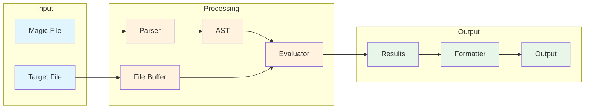
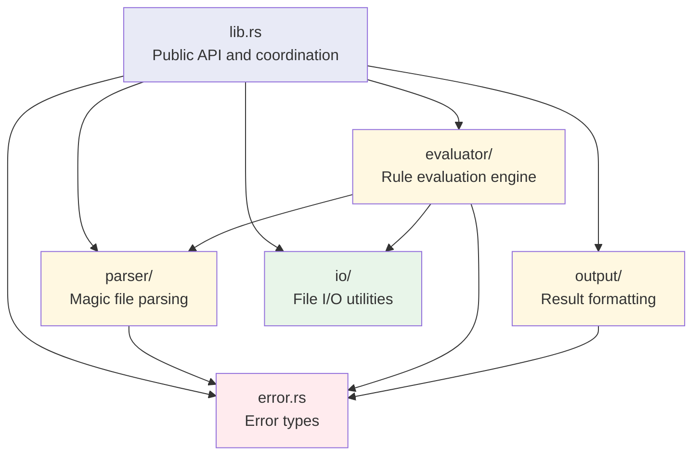

# Architecture Overview

The libmagic-rs library is designed around a clean separation of concerns, following a parser-evaluator architecture that promotes maintainability, testability, and performance.

## High-Level Architecture



## Core Components

### 1. Parser Module (`src/parser/`)

The parser is responsible for converting magic files (text-based DSL) into an Abstract Syntax Tree (AST).

**Key Files:**

- `ast.rs`: Core data structures representing magic rules (✅ Complete)
- `grammar.rs`: nom-based parsing components for magic file syntax (✅ Partial)
- `mod.rs`: Parser interface and coordination (🔄 In development)

**Responsibilities:**

- Parse magic file syntax into structured data (✅ Components implemented)
- Handle hierarchical rule relationships (🔄 In development)
- Validate syntax and report meaningful errors (✅ Basic validation)
- Support incremental parsing for large magic databases (📋 Planned)

**Current Implementation Status:**

- ✅ **Number parsing**: Decimal and hexadecimal with overflow protection
- ✅ **Offset parsing**: Absolute offsets with comprehensive validation
- ✅ **Operator parsing**: Equality, inequality, and bitwise AND operators
- ✅ **Value parsing**: Strings, numbers, and hex byte sequences with escape sequences
- ✅ **Error handling**: Comprehensive nom error handling with meaningful messages
- 🔄 **Rule parsing**: Integration of components into complete rule parser
- 📋 **File parsing**: Complete magic file parsing with hierarchical rules

### 2. AST Data Structures (`src/parser/ast.rs`)

The AST provides a complete representation of magic rules in memory.

**Core Types:**

```rust
pub struct MagicRule {
    pub offset: OffsetSpec,       // Where to read data
    pub typ: TypeKind,            // How to interpret bytes
    pub op: Operator,             // Comparison operation
    pub value: Value,             // Expected value
    pub message: String,          // Human-readable description
    pub children: Vec<MagicRule>, // Nested rules
    pub level: u32,               // Indentation level
}
```

**Design Principles:**

- **Immutable by default**: Rules don't change after parsing
- **Serializable**: Full serde support for caching
- **Self-contained**: No external dependencies in AST nodes
- **Type-safe**: Rust's type system prevents invalid rule combinations

### 3. Evaluator Module (`src/evaluator/`)

The evaluator executes magic rules against file buffers to identify file types.

**Planned Structure:**

- `mod.rs`: Main evaluation engine and coordination
- `offset.rs`: Offset resolution (absolute, indirect, relative)
- `types.rs`: Type interpretation with endianness handling
- `operators.rs`: Comparison and bitwise operations

**Key Features:**

- **Hierarchical Evaluation**: Parent rules must match before children
- **Lazy Evaluation**: Only process rules when necessary
- **Bounds Checking**: Safe buffer access with overflow protection
- **Context Preservation**: Maintain state across rule evaluations

### 4. I/O Module (`src/io/`)

Provides efficient file access through memory-mapped I/O. (✅ Complete)

**Implemented Features:**

- **FileBuffer**: Memory-mapped file buffers using `memmap2`
- **Safe buffer access**: Comprehensive bounds checking with `safe_read_bytes` and `safe_read_byte`
- **Error handling**: Structured IoError types for all failure scenarios
- **Resource management**: RAII patterns with automatic cleanup
- **File validation**: Size limits, empty file detection, and metadata validation
- **Overflow protection**: Safe arithmetic in all buffer operations

**Key Components:**

```rust
pub struct FileBuffer {
    mmap: Mmap,
    path: PathBuf,
}

pub fn safe_read_bytes(buffer: &[u8], offset: usize, length: usize) -> Result<&[u8], IoError>
pub fn safe_read_byte(buffer: &[u8], offset: usize) -> Result<u8, IoError>
pub fn validate_buffer_access(buffer_size: usize, offset: usize, length: usize) -> Result<(), IoError>
```

### 5. Output Module (`src/output/`)

Formats evaluation results into different output formats.

**Planned Formatters:**

- `text.rs`: Human-readable output (GNU `file` compatible)
- `json.rs`: Structured JSON output with metadata
- `mod.rs`: Format selection and coordination

## Data Flow

### 1. Magic File Loading


1. **Parsing**: Convert text DSL to structured AST
2. **Validation**: Check rule consistency and dependencies
3. **Optimization**: Reorder rules for evaluation efficiency
4. **Caching**: Serialize compiled rules for reuse

### 2. File Evaluation


1. **File Access**: Create memory-mapped buffer
2. **Rule Matching**: Execute rules hierarchically
3. **Result Collection**: Gather matches and metadata
4. **Output Generation**: Format results as text or JSON

## Design Patterns

### Parser-Evaluator Separation

The clear separation between parsing and evaluation provides:

- **Independent Testing**: Each component can be tested in isolation
- **Performance Optimization**: Rules can be pre-compiled and cached
- **Flexible Input**: Support for different magic file formats
- **Error Isolation**: Parse errors vs. evaluation errors are distinct

### Hierarchical Rule Processing

Magic rules form a tree structure where:

- **Parent rules** define broad file type categories
- **Child rules** provide specific details and variants
- **Evaluation stops** when a definitive match is found
- **Context flows** from parent to child evaluations

```mermaid
flowchart TD
    R[Root Rule<br/>e.g., "0 string PK"]
    R -->|match| C1[Child Rule 1<br/>e.g., ">4 byte 0x14"]
    R -->|match| C2[Child Rule 2<br/>e.g., ">4 byte 0x06"]
    C1 -->|match| G1[Grandchild<br/>ZIP archive v2.0]
    C2 -->|match| G2[Grandchild<br/>ZIP archive v1.0]

    style R fill:#e3f2fd
    style C1 fill:#fff3e0
    style C2 fill:#fff3e0
    style G1 fill:#c8e6c9
    style G2 fill:#c8e6c9
```

### Memory-Safe Buffer Access

All buffer operations use safe Rust patterns:

```rust
// Safe buffer access with bounds checking
fn read_bytes(buffer: &[u8], offset: usize, length: usize) -> Option<&[u8]> {
    buffer.get(offset..offset.saturating_add(length))
}
```

### Error Handling Strategy

The library uses Result types throughout:

```rust
pub type Result<T> = std::result::Result<T, LibmagicError>;

#[derive(Debug, Error)]
pub enum LibmagicError {
    #[error("Parse error at line {line}: {message}")]
    ParseError { line: usize, message: String },

    #[error("Evaluation error: {0}")]
    EvaluationError(String),

    #[error("IO error: {0}")]
    IoError(#[from] std::io::Error),
}
```

## Performance Considerations

### Memory Efficiency

- **Zero-copy operations** where possible
- **Memory-mapped I/O** to avoid loading entire files
- **Lazy evaluation** to skip unnecessary work
- **Rule caching** to avoid re-parsing magic files

### Computational Efficiency

- **Early termination** when definitive matches are found
- **Optimized rule ordering** based on match probability
- **Efficient string matching** using algorithms like Aho-Corasick
- **Minimal allocations** in hot paths

### Scalability

- **Parallel evaluation** for multiple files (future)
- **Streaming support** for large files (future)
- **Incremental parsing** for large magic databases
- **Resource limits** to prevent runaway evaluations

## Module Dependencies



**Dependency Rules:**

- **No circular dependencies** between modules
- **Clear interfaces** with well-defined responsibilities
- **Minimal coupling** between components
- **Testable boundaries** for each module

This architecture ensures the library is maintainable, performant, and extensible while providing a clean API for both CLI and library usage.
