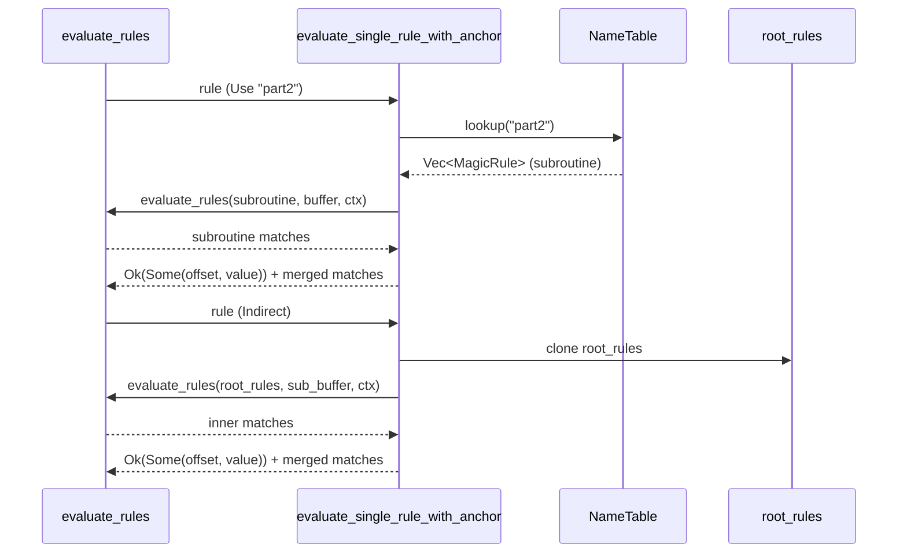

# Evaluator Engine

The evaluator runs magic rules against a file buffer, walking the rule tree top-down. When a parent rule matches, its children get a shot; offset, type, and operator are resolved per rule. Bad inputs (buffer overruns, invalid offsets, malformed types) cause that rule to be skipped rather than aborting the whole match.

## Overview

For each top-level rule, the engine loads the file into a memory-mapped buffer, resolves the rule's offset, reads the typed value at that offset, applies the rule's operator against the rule's value, and — if it matched — recurses into the rule's children. Each match produces a `RuleMatch` carrying the offset, value, message, and depth in the hierarchy.

## Architecture

```text
File Buffer → Offset Resolution → Type Reading → Operator Application → Results
     ↑              ↑                  ↑              ↑                    ↑
Memory Map    Context State      Endian Handling   Match Logic      Hierarchical
```

## Module Organization

The evaluator module separates public interface from implementation:

- **`evaluator/mod.rs`** - Public API surface: defines `EvaluationContext` and `RuleMatch` types, re-exports core evaluation functions from the engine submodule. Also defines `pub(crate) struct RuleEnvironment { root_rules, name_table }` — the optional environment attached to `EvaluationContext::rule_env` that carries the full rule list and the `name`/`use` subroutine table for meta-type dispatch.
- **`evaluator/engine/mod.rs`** - Core evaluation implementation: `evaluate_single_rule`, `evaluate_rules`, `evaluate_rules_with_config`. Also hosts the per-level `sibling_matched` bookkeeping and inline dispatch for `MetaType::Default`, `MetaType::Clear`, `MetaType::Use`, and `MetaType::Indirect`.
- **`evaluator/offset/mod.rs`** - Offset resolution
- **`evaluator/operators/mod.rs`** - Operator application
- **`evaluator/types/`** - Type reading and coercion (organized as submodules as of v0.4.2)
  - **`types/mod.rs`** - Internal type-reading API: `pub(crate)` dispatchers (`read_typed_value_with_pattern`, `read_pattern_match`, `coerce_value_to_type`) plus re-exports of leaf `read_*` functions
  - **`types/numeric.rs`** - Numeric type handling: `read_byte`, `read_short`, `read_long`, `read_quad` with endianness and signedness support
  - **`types/float.rs`** - Floating-point type handling: `read_float` (32-bit IEEE 754), `read_double` (64-bit IEEE 754) with endianness support
  - **`types/date.rs`** - Date and timestamp type handling: `read_date` (32-bit Unix timestamps), `read_qdate` (64-bit Unix timestamps) with endianness and UTC/local time support
  - **`types/string.rs`** - String type handling: `read_string` with null-termination and UTF-8 conversion, `read_pstring` with configurable length-prefix widths (1, 2, or 4 bytes)
  - **`types/tests.rs`** - Module tests
- **`evaluator/strength.rs`** - Rule strength calculation

From a public API perspective, all types and functions are imported from the `evaluator` module — the internal submodule layout is not part of the public surface.

## Core Components

### EvaluationContext

Maintains state during rule processing:

```rust
pub struct EvaluationContext {
    /// Current offset position for relative calculations
    current_offset: usize,
    /// End offset of the most recent successful match (GNU file anchor)
    last_match_end: usize,
    /// Current recursion depth for safety limits
    recursion_depth: u32,
    /// Configuration for evaluation behavior
    config: EvaluationConfig,
}
```

Note: Fields are private; use accessor methods like `current_offset()`, `recursion_depth()`, and `config()`.

**Public Methods:**

- `new()` - Create context with default configuration
- `current_offset()` / `set_current_offset()` - Track current buffer position
- `recursion_depth()` - Query current recursion depth
- `increment_recursion_depth()` / `decrement_recursion_depth()` - Track recursion safely
- `timeout_ms()` - Query configured timeout
- `reset()` - Reset context state for reuse (clears `current_offset`, `last_match_end`, and `recursion_depth`)

**Internal (`pub(crate)`) — engine use only, not callable from outside the crate:**

- `last_match_end()` - Get end offset of the most recent match (the GNU `file` anchor used for relative offset resolution)
- `set_last_match_end(pos: usize)` - Advance the previous-match anchor (called by `evaluate_rules` after each match)

External library users should not depend on these methods. Use `evaluate_rules` (or `evaluate_rules_with_config`) with an `EvaluationContext` and let the engine manage the anchor automatically. The anchor is reset alongside the other mutable state by `EvaluationContext::reset()`.

### RuleMatch

Represents a successful rule match:

```rust
pub struct RuleMatch {
    /// Human-readable description from the matched rule
    pub message: String,
    /// Offset where the match occurred
    pub offset: usize,
    /// Depth in the rule hierarchy (0 = root rule)
    pub level: u32,
    /// The matched value (parsed according to rule type)
    pub value: Value,
    /// Confidence score (0.0 to 1.0) based on rule hierarchy depth
    pub confidence: f64,
}
```

The `Value` type is from `parser::ast::Value` and represents the actual matched content according to the rule's type specification. Note that `Value` implements only `PartialEq` (not `Eq`) due to floating-point NaN semantics.

`RuleMatch` also carries a `pub type_kind: TypeKind` field used by the engine for width calculations and format substitution. The field is part of the public Rust API (accessible to consumers via field access) but is excluded from JSON serialization via `#[serde(skip)]` so the parser AST does not leak into structured output.

### Offset Resolution (`evaluator/offset.rs`)

- **Absolute offsets**: Direct file positions (`0`, `0x100`)
- **Relative offsets**: Resolved using `last_match_end + delta` from the previous match anchor (`&+4`, `&-2`)
- **From-end offsets**: Calculated from file size (`-4` from end)
- **Bounds checking**: All offset calculations are validated

```rust
pub fn resolve_offset(
    spec: &OffsetSpec,
    buffer: &[u8],
) -> Result<usize, LibmagicError>
```

The evaluator uses `resolve_offset_with_context` internally to thread the previous-match anchor through relative offset resolution. `resolve_offset` (the public API) defaults the anchor to 0. For `OffsetSpec::Relative(N)`, this means non-negative deltas resolve like `Absolute(N)` from the start of the buffer, but negative deltas underflow the anchor and return `EvaluationError::InvalidOffset` — they are *not* interpreted like `OffsetSpec::Absolute(-N)` from the end of the buffer. Callers needing GNU `file` anchor semantics (so relative offsets resolve against actual prior matches) should use `evaluate_rules` with an `EvaluationContext`, which tracks the anchor across rules.

Relative offsets resolve as `last_match_end + delta` with bounds and overflow checks. After each successful match, the context advances `last_match_end` by the bytes consumed by the matched type (c-string types include NUL terminators, pstring types include length prefixes).

### Type Reading (`evaluator/types/`)

The types module is organized into submodules for numeric, floating-point, date/timestamp, string, regex, and search handling. Each submodule reads bytes from the buffer according to one type category.

- **Byte**: Single byte values (signed or unsigned)
- **Short**: 16-bit integers with endianness
- **Long**: 32-bit integers with endianness
- **Quad**: 64-bit integers with endianness
- **Float**: 32-bit IEEE 754 floating-point with endianness (native, big-endian `befloat`, little-endian `lefloat`)
- **Double**: 64-bit IEEE 754 floating-point with endianness (native, big-endian `bedouble`, little-endian `ledouble`)
- **Date**: 32-bit Unix timestamps (signed seconds since epoch) with configurable endianness and UTC/local time formatting
- **QDate**: 64-bit Unix timestamps (signed seconds since epoch) with configurable endianness and UTC/local time formatting
- **String**: Byte sequences with length limits and flag-based comparison semantics (case-insensitive, whitespace handling, etc.) when flags are present
- **PString**: Pascal-style length-prefixed strings with 1-byte (`/B`), 2-byte (`/H` or `/h`), or 4-byte (`/L` or `/l`) length prefixes, supporting big-endian and little-endian byte order
- **Regex**: Binary-safe regex matching via `regex::bytes::Regex` with `unicode(false)`, so hex escapes like `\xHH` match the literal byte value for all `HH` (including bytes `>= 0x80`). `/c` enables case-insensitive matching, `/s` advances the relative-offset anchor to match-start instead of match-end, and `/l` measures the scan window in lines instead of bytes (with an 8192-byte hard cap). Multi-line regex matching is always on via unconditional `REG_NEWLINE`, so `^`/`$` match at line boundaries regardless of `/l`. Bareword (unquoted) regex patterns are resolved using GNU `file`'s `getstr` escape table before compilation, so octal escapes like `\040` and control characters like `\t` produce the bytes GNU `file` would. The evaluator accepts both `Value::String` and `Value::Bytes` as pattern operands (bytes are lossily decoded to UTF-8 with a `warn!` on real substitution). When a regex rule lacks a valid pattern operand, the evaluator gracefully skips that rule rather than aborting the entire evaluation.
- **Search**: Bounded literal pattern scan with flag support. The range is optional (`Option<NonZeroUsize>`): `search/N` caps the scan window to `N` bytes from the offset, while a bare `search` (`None`) scans to end-of-buffer (matching the reference `file` binary's `str_range == 0`); `search/0` is a parse error. Accepts nine flag suffixes (`/s`, `/c`, `/C`, `/w`, `/W`, `/T`, `/f`, `/t`, `/b`) that control scan behavior and anchor advancement. When only anchor-only flags (`/s`, `/t`, `/b`) are set or no flags are present, the SIMD-accelerated `memchr::memmem::find` fast path is used. When comparison-altering flags (`/c`, `/C`, `/w`, `/W`, `/T`, `/f`) are set, a byte-by-byte comparison through `compare_string_with_flags` is used. The `/s` flag sets the previous-match anchor for relative-offset children to match-START instead of match-END.
- **Bounds checking**: Prevents buffer overruns

The type-reading functions are internal (`pub(crate)`) engine helpers. External library users evaluate rules through `evaluate_rules` or `evaluate_rules_with_config`.

**Floating-Point Type Reading (`evaluator/types/float.rs`):**

```rust
pub fn read_float(
    buffer: &[u8],
    offset: usize,
    endian: Endianness,
) -> Result<Value, TypeReadError>

pub fn read_double(
    buffer: &[u8],
    offset: usize,
    endian: Endianness,
) -> Result<Value, TypeReadError>
```

- `read_float()` reads 4 bytes and interprets as `f32`, converting to `f64` and returning `Value::Float(f64)`
- `read_double()` reads 8 bytes and interprets as `f64`, returning `Value::Float(f64)`
- Both respect endianness specified in `TypeKind::Float` or `TypeKind::Double`

**Date and QDate Type Reading (`evaluator/types/date.rs`):**

```rust
pub fn read_date(
    buffer: &[u8],
    offset: usize,
    endian: Endianness,
    utc: bool,
) -> Result<Value, TypeReadError>

pub fn read_qdate(
    buffer: &[u8],
    offset: usize,
    endian: Endianness,
    utc: bool,
) -> Result<Value, TypeReadError>
```

- `read_date()` reads 4 bytes as a 32-bit Unix timestamp (seconds since epoch) and returns `Value::String` formatted as `"Www Mmm DD HH:MM:SS YYYY"` to match GNU file output
- `read_qdate()` reads 8 bytes as a 64-bit Unix timestamp (seconds since epoch) and returns `Value::String` formatted as `"Www Mmm DD HH:MM:SS YYYY"` to match GNU file output
- Both support endianness (little-endian, big-endian, native)
- Both support UTC or local time formatting
- The evaluator reads raw integer timestamps from the buffer and converts them to formatted date strings for comparison
- Example: A 32-bit value `1234567890` at offset 0 with type `ldate` would be evaluated as `"Fri Feb 13 23:31:30 2009"`

**Pascal String Type Reading (`evaluator/types/string.rs`):**

```rust
pub fn read_pstring(
    buffer: &[u8],
    offset: usize,
    max_length: Option<usize>,
    length_width: PStringLengthWidth,
    length_includes_itself: bool,
) -> Result<Value, TypeReadError>
```

- `read_pstring()` reads a length-prefixed Pascal string with configurable prefix width
- **Length prefix width** (`length_width`):
  - `PStringLengthWidth::OneByte` - 1-byte length prefix (`/B` suffix, default)
  - `PStringLengthWidth::TwoByteBE` - 2-byte big-endian length prefix (`/H` suffix)
  - `PStringLengthWidth::TwoByteLE` - 2-byte little-endian length prefix (`/h` suffix)
  - `PStringLengthWidth::FourByteBE` - 4-byte big-endian length prefix (`/L` suffix)
  - `PStringLengthWidth::FourByteLE` - 4-byte little-endian length prefix (`/l` suffix)
- **Length interpretation**:
  - Reads 1, 2, or 4 bytes from buffer using `from_be_bytes` or `from_le_bytes` depending on variant
  - The length value specifies how many bytes of string data follow the prefix
- **`/J` flag** (`length_includes_itself`):
  - When `true`, the stored length value includes the prefix width itself (JPEG-style)
  - The evaluator subtracts the prefix width (1, 2, or 4 bytes) from the length to get effective content length
  - Example: A 2-byte big-endian prefix with value `7` and `/J` flag yields `7 - 2 = 5` bytes of string content
- Returns `Value::String` with UTF-8 conversion (using lossy conversion for invalid UTF-8)

### Operator Application (`evaluator/operators.rs`)

- **Equal** (`=`, `==`): Exact value matching
- **NotEqual** (`!=`, `<>`): Non-matching values
- **LessThan** (`<`): Less-than comparison (numeric or lexicographic) *(added in v0.2.0)*
- **GreaterThan** (`>`): Greater-than comparison (numeric or lexicographic) *(added in v0.2.0)*
- **LessEqual** (`<=`): Less-than-or-equal comparison (numeric or lexicographic) *(added in v0.2.0)*
- **GreaterEqual** (`>=`): Greater-than-or-equal comparison (numeric or lexicographic) *(added in v0.2.0)*
- **BitwiseAnd** (`&`): Pattern matching for flags
- **BitwiseAndMask**: AND with mask then compare

Comparison operators support numeric comparisons across different integer types using `i128` coercion for cross-type compatibility.

**Floating-Point Operator Semantics:**

Float values (`Value::Float`) work with comparison and equality operators but have special handling:

- **Equality operators** (`==`, `!=`): Use epsilon-aware comparison with `f64::EPSILON` tolerance
  - Two floats are considered equal when `|a - b| <= f64::EPSILON`
  - Implementation is in `floats_equal()` helper function (`evaluator/operators/equality.rs`)
- **Ordering operators** (`<`, `>`, `<=`, `>=`): Use IEEE 754 `partial_cmp` semantics
  - Standard floating-point ordering: `-∞ < finite values < +∞`
  - Implementation is in `compare_values()` function (`evaluator/operators/comparison.rs`)
- **NaN handling**:
  - `NaN != NaN` returns `true` (NaN is never equal to anything, including itself)
  - All comparison operations with NaN return `false` (NaN is not comparable)
- **Infinity handling**:
  - Positive and negative infinity are only equal to the same sign of infinity
  - Infinities are ordered correctly: `NEG_INFINITY < finite < INFINITY`
- **Type mismatch**: Float values cannot be compared with `Int` or `Uint` (returns `false` or `None`)

```rust
pub fn apply_operator(
    operator: &Operator,
    left: &Value,
    right: &Value,
) -> bool
```

**Example with comparison operators:**

```rust
use libmagic_rs::parser::ast::{Operator, Value};
use libmagic_rs::evaluator::operators::apply_operator;

// Less-than comparison (v0.2.0+)
assert!(apply_operator(
    &Operator::LessThan,
    &Value::Uint(5),
    &Value::Uint(10)
));

// Greater-than-or-equal comparison (v0.2.0+)
assert!(apply_operator(
    &Operator::GreaterEqual,
    &Value::Uint(10),
    &Value::Uint(10)
));

// Cross-type integer comparison (v0.2.0+)
assert!(apply_operator(
    &Operator::LessThan,
    &Value::Int(-1),
    &Value::Uint(0)
));
```

**Example with floating-point operators:**

```rust
use libmagic_rs::parser::ast::{Operator, Value};
use libmagic_rs::evaluator::operators::apply_operator;

// Epsilon-aware equality
assert!(apply_operator(
    &Operator::Equal,
    &Value::Float(1.0),
    &Value::Float(1.0 + f64::EPSILON)
));

// Float ordering
assert!(apply_operator(
    &Operator::LessThan,
    &Value::Float(1.5),
    &Value::Float(2.0)
));

// NaN inequality
assert!(apply_operator(
    &Operator::NotEqual,
    &Value::Float(f64::NAN),
    &Value::Float(f64::NAN)
));

// Infinity comparison
assert!(apply_operator(
    &Operator::LessThan,
    &Value::Float(f64::NEG_INFINITY),
    &Value::Float(0.0)
));
```

## Evaluation Algorithm

The evaluator uses a depth-first hierarchical algorithm:

```rust
pub fn evaluate_rules(
    rules: &[MagicRule],
    buffer: &[u8],
) -> Result<Vec<RuleMatch>, EvaluationError>
```

**Algorithm:**

1. For each root rule:

   - Resolve offset from buffer
   - Read value at offset according to type
   - Apply operator to compare actual vs expected
   - If match: add to results, recursively evaluate children
   - If no match: skip children, continue to next rule

2. Child rules inherit context from parent match

3. Results accumulate hierarchically (parent message + child details)

### Meta-type Dispatch

Before calling `evaluate_single_rule_with_anchor` for a value-read rule, `evaluate_rules` inspects the rule's `TypeKind` for meta-type dispatch. Each `MetaType` variant has distinct semantics:

- **`MetaType::Clear`**: Sets the per-level `sibling_matched` flag to `false`. No match is recorded, the anchor is unchanged, and children are not evaluated.
- **`MetaType::Default`**: Fires only when `!sibling_matched` at the current level. On fire, records a `RuleMatch`, evaluates children (inheriting the match context), and sets `sibling_matched = true`.
- **`MetaType::Use(name)`**: Looks up `name` in `RuleEnvironment::name_table`. On hit, evaluates the subroutine's child rules at the resolved offset, propagates their matches into the caller's match vector, then also evaluates the `use` rule's own `rule.children`. On miss, logs a `warn!` and returns `Ok(None)` (treated as non-match).
- **`MetaType::Indirect`**: Resolves the rule's offset against the buffer, slices the buffer at that point, resets the `EvaluationContext` anchor to 0, calls `evaluate_rules` recursively with `RuleEnvironment::root_rules` (the complete top-level rule list), and then restores the caller's anchor on return. Recursion is bounded by `EvaluationConfig::max_recursion_depth`.
- **`MetaType::Name`**: Unreachable after load-time extraction — `name` blocks are hoisted out of the rule list by `parser::name_table::extract_name_table` before the evaluator ever sees them. Defensive arm returns `Ok(None)` and emits a `debug!` rather than `debug_assert!` so that property tests synthesizing arbitrary `TypeKind` values do not break the never-panics invariant.
- **`MetaType::Offset`**: Resolves the rule's offset against the buffer and records a `RuleMatch` whose `value` is `Value::Uint(resolved_offset)`. The evaluator stores the raw resolved offset as `value` without substituting any printf specifiers — printf substitution (`%lld`, `%d`, etc.) is performed later during output/message assembly by `format_magic_message` (called from `MagicDatabase::build_result`), not inside `evaluate_rules`. Used by magic fixtures that need to report "matched at offset N" in the output (e.g., GNU `file`'s `searchbug.magic` fixture).



### Hierarchical Processing

```mermaid
flowchart TD
    R[Root Rule<br/>e.g., "0 string \x7fELF"]
    R -->|match| C1[Child Rule 1<br/>e.g., ">4 byte 1"]
    R -->|match| C2[Child Rule 2<br/>e.g., ">4 byte 2"]
    C1 -->|match| G1[Result:<br/>ELF 32-bit]
    C2 -->|match| G2[Result:<br/>ELF 64-bit]

    style R fill:#e3f2fd
    style C1 fill:#fff3e0
    style C2 fill:#fff3e0
    style G1 fill:#c8e6c9
    style G2 fill:#c8e6c9
```

## Configuration

Evaluation behavior is controlled via `EvaluationConfig`:

```rust
pub struct EvaluationConfig {
    /// Maximum recursion depth for nested rules (default: 20)
    pub max_recursion_depth: u32,
    /// Maximum string length to read (default: 8192)
    pub max_string_length: usize,
    /// Stop at first match or continue for all matches (default: true)
    pub stop_at_first_match: bool,
    /// Enable MIME type mapping in results (default: false)
    pub enable_mime_types: bool,
    /// Timeout for evaluation in milliseconds (default: None)
    pub timeout_ms: Option<u64>,
}
```

**Preset Configurations:**

```rust
// Default balanced configuration
let config = EvaluationConfig::default();

// Optimized for speed
let config = EvaluationConfig::performance();

// Find all matches with full details
let config = EvaluationConfig::comprehensive();
```

## Safety Features

### Memory Safety

- **Bounds checking**: All buffer access is validated before reading
- **Integer overflow protection**: Safe arithmetic using `checked_*` and `saturating_*`
- **Resource limits**: Configurable limits prevent resource exhaustion

### Error Handling

The evaluator uses graceful degradation:

- **Invalid offsets**: Skip rule, continue with others
- **Type mismatches**: Skip rule, continue with others
- **Missing pattern operand**: When a pattern-bearing type (`Regex`, `Search`, flagged `String`) lacks a valid `String`/`Bytes` pattern operand, skip that rule rather than aborting the entire evaluation
- **Regex compile failure**: When a regex pattern fails to compile (including the 1 MiB `REGEX_COMPILE_SIZE_LIMIT` denial-of-service guard), skip that rule and log a `warn!` rather than aborting the entire evaluation
- **Timeout exceeded**: Return error (partial results are not preserved)
- **Recursion limit**: Stop descent, continue siblings

```rust
pub enum EvaluationError {
    BufferOverrun { offset: usize },
    InvalidOffset { offset: i64 },
    UnsupportedType { type_name: String },
    RecursionLimitExceeded { depth: u32 },
    StringLengthExceeded { length: usize, max_length: usize },
    InvalidStringEncoding { offset: usize },
    Timeout { timeout_ms: u64 },
    TypeReadError(TypeReadError),
}
```

### Timeout Protection

```rust
// With 5 second timeout
let config = EvaluationConfig {
    timeout_ms: Some(5000),
    ..Default::default()
};

let result = evaluate_rules_with_config(&rules, buffer, &config)?;
```

## API Reference

### Primary Functions

```rust
/// Evaluate rules with context for recursion tracking
pub fn evaluate_rules(
    rules: &[MagicRule],
    buffer: &[u8],
    context: &mut EvaluationContext,
) -> Result<Vec<RuleMatch>, LibmagicError>;

/// Evaluate rules with custom configuration (creates context internally)
pub fn evaluate_rules_with_config(
    rules: &[MagicRule],
    buffer: &[u8],
    config: &EvaluationConfig,
) -> Result<Vec<RuleMatch>, LibmagicError>;

/// Evaluate a single rule with an explicit context
///
/// Thin wrapper around `evaluate_rules` for a single top-level rule.
/// Takes a mutable `EvaluationContext` so timeout, recursion, and string
/// size limits are enforced consistently.
pub fn evaluate_single_rule(
    rule: &MagicRule,
    buffer: &[u8],
    context: &mut EvaluationContext,
) -> Result<Vec<RuleMatch>, LibmagicError>;
```

### Usage Example

```rust
use libmagic_rs::{evaluate_rules, EvaluationConfig, EvaluationContext};
use libmagic_rs::parser::parse_text_magic_file;

// Parse magic rules
let magic_content = r#"
0 string \x7fELF ELF executable
>4 byte 1 32-bit
>4 byte 2 64-bit
"#;
let parsed = parse_text_magic_file(magic_content)?;

// Read target file
let buffer = std::fs::read("sample.bin")?;

// Evaluate with default config. The low-level `evaluate_rules` takes only
// the top-level rules; `parsed.name_table` is handled by `MagicDatabase`
// (see library-api.md) and is ignored here.
let mut ctx = EvaluationContext::new(EvaluationConfig::default());
let matches = evaluate_rules(&parsed.rules, &buffer, &mut ctx)?;

for m in matches {
    println!("Match at offset {}: {}", m.offset, m.message);
}
```

**Example with comparison operators (v0.2.0+):**

```rust
use libmagic_rs::{evaluate_rules, EvaluationConfig, EvaluationContext};
use libmagic_rs::parser::parse_text_magic_file;

// Parse magic rule with comparison operator
let magic_content = r#"
0 leshort <100 Small value detected
0 leshort >=1000 Large value detected
"#;
let parsed = parse_text_magic_file(magic_content)?;

let buffer = vec![0x0A, 0x00]; // Little-endian 10
let mut ctx = EvaluationContext::new(EvaluationConfig::default());
let matches = evaluate_rules(&parsed.rules, &buffer, &mut ctx)?;

// Matches first rule (<100)
assert_eq!(matches[0].message, "Small value detected");
```

**Example with floating-point types:**

```rust
use libmagic_rs::{evaluate_rules, EvaluationConfig, EvaluationContext};
use libmagic_rs::parser::parse_text_magic_file;

// Parse magic rule with float type
let magic_content = r#"
0 lefloat 3.14159 Pi constant detected
0 bedouble >100.0 Large double value
"#;
let parsed = parse_text_magic_file(magic_content)?;

// IEEE 754 little-endian representation of 3.14159f32
let buffer = vec![0xd0, 0x0f, 0x49, 0x40];
let mut ctx = EvaluationContext::new(EvaluationConfig::default());
let matches = evaluate_rules(&parsed.rules, &buffer, &mut ctx)?;

assert_eq!(matches[0].message, "Pi constant detected");
```

**Example with pstring types:**

```rust
use libmagic_rs::{evaluate_rules, EvaluationConfig, EvaluationContext};
use libmagic_rs::parser::parse_text_magic_file;

// Parse magic rules with pstring variants
let magic_content = r#"
0 pstring/B MAGIC Pascal string (1-byte prefix)
0 pstring/H =\x00\x05MAGIC Pascal string (2-byte BE prefix)
0 pstring/h =\x05\x00MAGIC Pascal string (2-byte LE prefix)
0 pstring/L =\x00\x00\x00\x05MAGIC Pascal string (4-byte BE prefix)
0 pstring/l =\x05\x00\x00\x00MAGIC Pascal string (4-byte LE prefix)
"#;
let parsed = parse_text_magic_file(magic_content)?;

// 1-byte prefix: length=5, then "MAGIC"
let buffer = b"\x05MAGIC";
let mut ctx = EvaluationContext::new(EvaluationConfig::default());
let matches = evaluate_rules(&parsed.rules, &buffer, &mut ctx)?;
assert_eq!(matches[0].message, "Pascal string (1-byte prefix)");

// 2-byte big-endian prefix with /J flag: stored length 7 (includes 2-byte prefix), effective content 5 bytes
let magic_content_j = r#"
0 pstring/HJ =MAGIC JPEG-style pstring with self-inclusive length
"#;
let parsed_j = parse_text_magic_file(magic_content_j)?;
let buffer_j = b"\x00\x07MAGIC"; // 2-byte BE prefix: value 7, minus 2 = 5 bytes of content
let mut ctx_j = EvaluationContext::new(EvaluationConfig::default());
let matches_j = evaluate_rules(&parsed_j.rules, &buffer_j, &mut ctx_j)?;
assert_eq!(matches_j[0].message, "JPEG-style pstring with self-inclusive length");
```

## Implementation Status

- [x] Basic evaluation engine structure
- [x] Offset resolution (absolute, relative, from-end)
- [x] Relative offset support with previous-match anchor tracking (PR #211, issue #38)
- [x] Type reading with endianness support (Byte, Short, Long, Quad, Float, Double, Date, QDate, String, PString with 1/2/4-byte prefixes)
- [x] Operator application (Equal, NotEqual, LessThan, GreaterThan, LessEqual, GreaterEqual, BitwiseAnd, BitwiseAndMask)
- [x] Hierarchical rule processing with child evaluation
- [x] Error handling with graceful degradation
- [x] Timeout protection
- [x] Recursion depth limiting
- [x] Comprehensive test coverage (150+ tests)
- [x] Indirect offset support (pointer dereferencing, issue #37)
- [x] Relative offset support (GNU `file` anchor semantics, issue #38)
- [x] Regex type support (binary-safe `regex::bytes::Regex` with `/c`, `/s`, `/l` flags and 8192-byte cap; unconditional `REG_NEWLINE`)
- [x] Search type support (bounded literal pattern scan via `memchr::memmem::find` with mandatory `NonZeroUsize` range; flag-based dispatch with `/s`/`/c`/`/C`/`/w`/`/W`/`/T`/`/f`/`/t`/`/b` modifiers for scan behavior and anchor advancement; PR #297)
- [x] String-type flag semantics (`/c`, `/C`, `/w`, `/W`, `/T`, `/f`, `/b`, `/t` modifiers for case-insensitive and whitespace-flexible matching; PR #234)
- [x] Meta-type directives: `default`, `clear`, `name`/`use` subroutines, `indirect` re-evaluation, `offset` resolved-address reporting (issue #42)
- [ ] Performance optimizations (rule ordering, caching)

## Performance Considerations

### Lazy Evaluation

- **Parent-first**: Only evaluate children if parent matches
- **Early termination**: Stop on first match when configured
- **Skip on error**: Continue evaluation after non-fatal errors

### Memory Efficiency

- **Memory mapping**: Files accessed via mmap, not loaded entirely
- **Zero-copy reads**: Slice references where possible
- **Bounded strings**: String reads limited to prevent memory exhaustion
