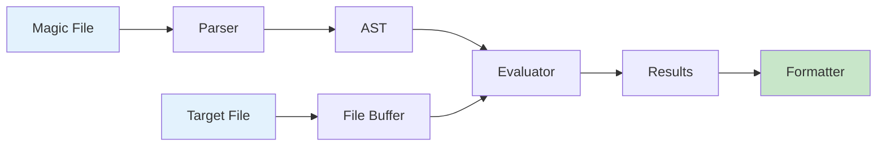

# Introduction

[![Crates.io][crates-badge]][crates-link] [![GitHub License][license-badge]][license-link] [![OpenSSF Scorecard][scorecard-badge]][scorecard-link] [![OpenSSF Best Practices][bestpractices-badge]][bestpractices-link]

libmagic-rs is a pure-Rust reimplementation of the libmagic library — the file-type detection engine behind the GNU `file` command. The library has no `unsafe` code in its own modules and uses memory-mapped I/O for file reads. The magic-file syntax matches GNU `file` closely; rules written for `file` should mostly work without changes.

This guide is the developer reference: the library, the `rmagic` CLI, and the magic-file format.

## What's in the box

The parser handles text-format magic files (`Magdir/` directories and individual files), with hierarchical rules, comments, line continuations, and a `parse_text_magic_file()` API. Format detection picks the right loader for a given path automatically.

The evaluator handles offset resolution (absolute, from-end, relative, indirect), the libmagic type primitives, the operator set (equality, inequality, comparisons, bitwise, any-value), cross-type integer coercion, and per-rule error recovery so a single bad rule doesn't abort the whole match. A `!:strength` directive lets rules adjust their priority.

The `rmagic` CLI takes one or more files (or stdin), produces text or JSON output, honors a per-file timeout, and supports `--use-builtin` for a no-external-files mode. Built-in rules ship for ELF, PE/DOS, ZIP, TAR, GZIP, JPEG, PNG, GIF, BMP, and PDF.

Smaller pieces worth knowing about: opt-in MIME type mapping, semantic tag extraction from match descriptions, confidence scoring based on hierarchy depth, three configuration presets (`default()`, `performance()`, `comprehensive()`) with security-bound validation, and structured error types covering parse, evaluation, config, file, and timeout failures.

The project is under active development. CI runs ~1,200 tests on every change, clippy runs in pedantic mode with warnings treated as errors, and no `unsafe` code is allowed in library modules.

## What's next

Indirect offsets with complex pointer dereferencing patterns, parallel evaluation across multiple files, and broader format coverage are on the roadmap. Binary `.mgc` support is intentionally out of scope — the project is text-magic only, OpenBSD-style.

## Architecture at a glance

Magic files become an AST at load time. The evaluator runs that AST against a file buffer at evaluation time. Output formatters turn results into text or JSON.

## How this guide is organized

The chapters move from end-user concerns toward internals: getting started and CLI usage first, then library integration and configuration, then architecture and per-module reference, then advanced topics (magic format, testing, performance), then contribution and release process. The appendices cover the API reference, full CLI reference, and example magic rules.

## Getting help

For bugs and feature requests, use [GitHub Issues](https://github.com/EvilBit-Labs/libmagic-rs/issues). For open-ended questions, [GitHub Discussions](https://github.com/EvilBit-Labs/libmagic-rs/discussions). Generated API documentation is at [docs.rs/libmagic-rs](https://docs.rs/libmagic-rs).

## Contributing

Contributions welcome. See [CONTRIBUTING.md](https://github.com/EvilBit-Labs/libmagic-rs/blob/main/CONTRIBUTING.md) and the [Development Setup](./development.md) guide.

## License

Apache 2.0 — see the [LICENSE](https://github.com/EvilBit-Labs/libmagic-rs/blob/main/LICENSE) file.

## Acknowledgments

This is a clean-room reimplementation. The original [libmagic](https://www.darwinsys.com/file/) is the work of Ian F. Darwin and Christos Zoulas, with many other contributors over the decades. We have benefited enormously from the magic-file format they shaped, and from the corpus of rules that ships with `file`.

[bestpractices-badge]: https://www.bestpractices.dev/projects/11947/badge
[bestpractices-link]: https://www.bestpractices.dev/projects/11947
[crates-badge]: https://img.shields.io/crates/v/libmagic-rs
[crates-link]: https://crates.io/crates/libmagic-rs
[license-badge]: https://img.shields.io/crates/l/libmagic-rs
[license-link]: https://github.com/EvilBit-Labs/libmagic-rs/blob/main/LICENSE
[scorecard-badge]: https://api.scorecard.dev/projects/github.com/EvilBit-Labs/libmagic-rs/badge
[scorecard-link]: https://scorecard.dev/viewer/?uri=github.com/EvilBit-Labs/libmagic-rs
