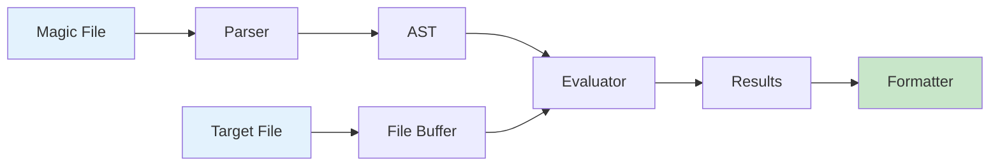

# Introduction

Welcome to the **libmagic-rs** developer guide! This documentation provides comprehensive information about the pure-Rust implementation of libmagic, the library that powers the `file` command for identifying file types.

## What is libmagic-rs?

libmagic-rs is a clean-room implementation of the libmagic library, written entirely in Rust. It provides:

- **Memory Safety**: Pure Rust with no unsafe code (except vetted dependencies)
- **Performance**: Memory-mapped I/O for efficient file processing
- **Compatibility**: Support for standard magic file syntax and formats
- **Modern Design**: Extensible architecture for contemporary file formats
- **Multiple Outputs**: Both human-readable text and structured JSON formats

## Project Status

🚀 **Active Development** - Core components are complete with ongoing feature additions.

### What's Complete

- **Core AST Structures**: Complete data model for magic rules with full serialization
- **Magic File Parser**: Full text magic file parsing with hierarchical structure, comments, continuations, and `parse_text_magic_file()` API
- **Format Detection**: Automatic detection of text files, directories (Magdir), and binary .mgc files with helpful error messages
- **Rule Evaluation Engine**: Complete hierarchical evaluation with offset resolution, type interpretation, comparison operators, cross-type integer coercion, and graceful error recovery
- **Memory-Mapped I/O**: FileBuffer implementation with memmap2 and comprehensive safety
- **CLI Tool (`rmagic`)**: Command-line interface with clap, text/JSON output, stdin support, magic file discovery, strict mode, timeouts, and built-in rules
- **Built-in Rules**: Pre-compiled detection for common file types (ELF, PE/DOS, ZIP, TAR, GZIP, JPEG, PNG, GIF, BMP, PDF) compiled at build time
- **MIME Type Mapping**: Opt-in MIME type detection via `enable_mime_types` configuration
- **Strength Calculation**: Rule priority scoring with `!:strength` directive support (add, subtract, multiply, divide, set)
- **Output Formatters**: Text and JSON output with tag enrichment and JSON Lines for batch processing
- **Confidence Scoring**: Match confidence based on rule hierarchy depth
- **Tag Extraction**: Semantic tag extraction from match descriptions (e.g., "executable", "elf", "archive")
- **Timeout Protection**: Configurable per-file evaluation timeouts to prevent DoS
- **Configuration Presets**: `performance()`, `comprehensive()`, and `default()` presets with security validation
- **Project Infrastructure**: Build system, strict linting, pre-commit hooks, and CI/CD
- **Extensive Test Coverage**: 940+ comprehensive tests covering all modules
- **Memory Safety**: Zero unsafe code with comprehensive bounds checking
- **Error Handling**: Structured error types (ParseError, EvaluationError, ConfigError, FileError, Timeout) with graceful degradation
- **Code Quality**: Strict clippy pedantic linting with zero-warnings policy

### Next Milestones

- Indirect offset support (complex pointer dereferencing patterns)
- Binary .mgc support (compiled magic database format)
- Rule caching (pre-compiled magic database)
- Parallel evaluation (multi-file processing)
- Extended type support (regex, date, etc.)

## Why Rust?

The choice of Rust for this implementation provides several key advantages:

1. **Memory Safety**: Eliminates entire classes of security vulnerabilities
2. **Performance**: Zero-cost abstractions and efficient compiled code
3. **Concurrency**: Safe parallelism for processing multiple files
4. **Ecosystem**: Rich crate ecosystem for parsing, I/O, and serialization
5. **Maintainability**: Strong type system and excellent tooling

## Architecture Overview

The library follows a clean parser-evaluator architecture:

This separation allows for:

- Independent testing of each component
- Flexible output formatting
- Efficient rule caching and optimization
- Clear error handling and debugging

## How to Use This Guide

This documentation is organized into five main parts:

- **Part I: User Guide** - Getting started, CLI usage, and basic library integration
- **Part II: Architecture & Implementation** - Deep dive into the codebase structure and components
- **Part III: Advanced Topics** - Magic file formats, testing, and performance optimization
- **Part IV: Integration & Migration** - Moving from libmagic and troubleshooting
- **Part V: Development & Contributing** - Contributing guidelines and development setup

The appendices provide quick reference materials for commands, examples, and compatibility information.

## Getting Help

- **Documentation**: This comprehensive guide covers all aspects of the library
- **API Reference**: Generated rustdoc for detailed API information (Appendix A)
- **Command Reference**: Complete CLI documentation (Appendix B)
- **Examples**: Magic file examples and patterns (Appendix C)
- **Issues**: [GitHub Issues](https://github.com/EvilBit-Labs/libmagic-rs/issues) for bugs and feature requests
- **Discussions**: [GitHub Discussions](https://github.com/EvilBit-Labs/libmagic-rs/discussions) for questions and ideas

## Contributing

We welcome contributions! See the [CONTRIBUTING.md](https://github.com/EvilBit-Labs/libmagic-rs/blob/main/CONTRIBUTING.md) file in the repository root and the [Development Setup](./development.md) guide for information on how to get started.

## License

This project is licensed under the Apache License 2.0. See the [LICENSE](https://github.com/EvilBit-Labs/libmagic-rs/blob/main/LICENSE) file for details.

## Acknowledgments

This project is inspired by and respects the original [libmagic](https://www.darwinsys.com/file/) implementation by Ian Darwin and the current maintainers led by Christos Zoulas. We aim to provide a modern, safe alternative while maintaining compatibility with the established magic file format.
