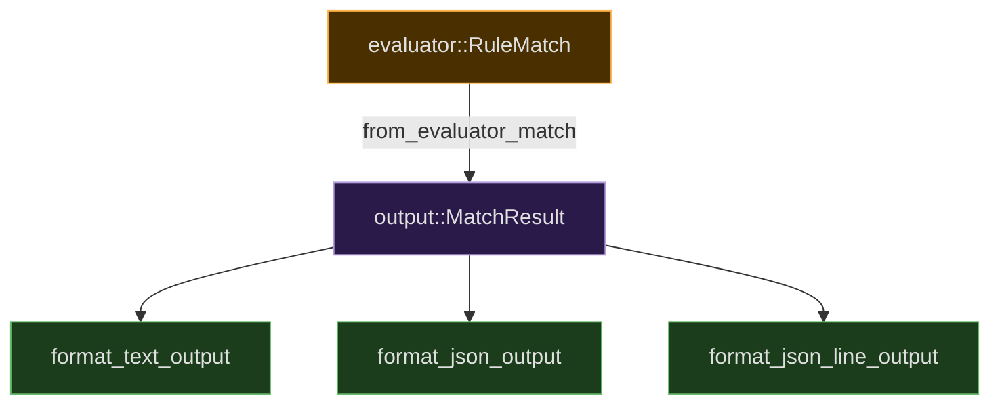
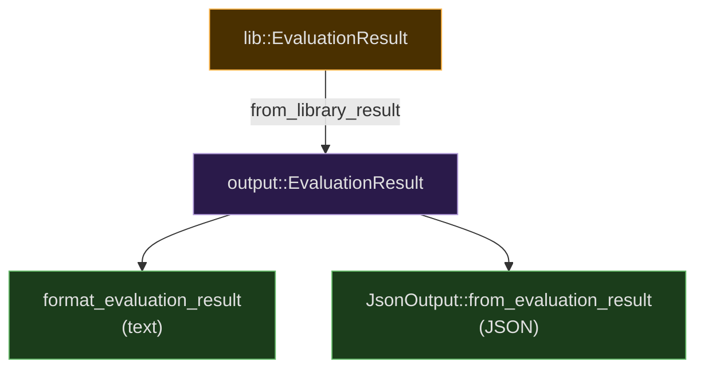

# Chapter 9: Output Formatters

The output module converts raw evaluation results into structured, consumable formats. It supports human-readable text output compatible with the GNU `file` command, pretty-printed JSON for single-file analysis, and compact JSON Lines for multi-file batch processing.

## Module Structure

The output module is organized across three files:

- **`src/output/mod.rs`** -- Core data structures (`EvaluationResult`, `MatchResult`, `EvaluationMetadata`) and the conversion layer from evaluator types to output types, including tag enrichment via a shared `LazyLock<TagExtractor>`.
- **`src/output/json.rs`** -- JSON-specific types (`JsonMatchResult`, `JsonOutput`, `JsonLineOutput`) and formatting functions for pretty-printed and compact JSON output.
- **`src/output/text.rs`** -- Text formatting functions that produce GNU `file`-compatible output.

## Core Data Types

### `output::MatchResult`

Represents a single magic rule match in the output layer. Created by converting from an evaluator-level `RuleMatch`, with additional fields for structured output.

```rust
pub struct MatchResult {
    pub message: String,           // Human-readable description
    pub offset: usize,             // Byte offset where match occurred
    pub length: usize,             // Number of bytes examined
    pub value: Value,              // Matched value (Bytes, String, Uint, Int)
    pub rule_path: Vec<String>,    // Hierarchical tags/rule names
    pub confidence: u8,            // Score 0-100 (clamped)
    pub mime_type: Option<String>, // Optional MIME type
}
```

Key constructors:

- `MatchResult::new(message, offset, value)` -- Creates a match with default confidence of 50.
- `MatchResult::with_metadata(...)` -- Creates a fully specified match. Confidence is clamped to 100.
- `MatchResult::from_evaluator_match(m, mime_type)` -- Converts from the evaluator's `RuleMatch`. Scales confidence from 0.0--1.0 to 0--100 and extracts rule path tags using the shared `TagExtractor`.

### `output::EvaluationResult`

The complete result of evaluating a file against magic rules.

```rust
pub struct EvaluationResult {
    pub filename: PathBuf,
    pub matches: Vec<MatchResult>,
    pub metadata: EvaluationMetadata,
    pub error: Option<String>,
}
```

Key methods:

- `EvaluationResult::from_library_result(result, filename)` -- Converts a library-level `EvaluationResult` to the output format. Enriches the first match's `rule_path` with tags extracted from the overall description when the rule path is empty.
- `primary_match()` -- Returns the match with the highest confidence score.
- `is_success()` -- Returns `true` when no error is present.

### `output::EvaluationMetadata`

Diagnostic information about the evaluation process.

```rust
pub struct EvaluationMetadata {
    pub file_size: u64,
    pub evaluation_time_ms: f64,
    pub rules_evaluated: u32,
    pub rules_matched: u32,
}
```

The `match_rate()` method returns the percentage of evaluated rules that matched (0.0 when no rules were evaluated).

## Tag Enrichment

The output module uses a static `LazyLock<TagExtractor>` (defined as `DEFAULT_TAG_EXTRACTOR`) to avoid allocating the keyword set on every conversion call. The `TagExtractor` (from `src/tags.rs`) maintains a `HashSet` of 16 keywords:

> executable, archive, image, video, audio, document, compressed, encrypted, text, binary, data, script, font, database, spreadsheet, presentation

Tag extraction happens at two points during conversion:

1. **Per-match**: `MatchResult::from_evaluator_match` calls `extract_rule_path` to normalize match messages into hyphenated, lowercase tag identifiers.
2. **Overall enrichment**: `EvaluationResult::from_library_result` calls `extract_tags` on the overall description to populate the first match's `rule_path` when it is empty after per-match extraction.

The `extract_tags` method performs case-insensitive substring matching and returns a sorted, deduplicated vector. The `extract_rule_path` method normalizes messages by lowercasing, replacing spaces with hyphens, and stripping non-alphanumeric characters.

## Text Output

The text module (`src/output/text.rs`) produces output compatible with the GNU `file` command.

### Functions

**`format_text_result(result) -> String`** -- Returns the match message as-is.

**`format_text_output(results) -> String`** -- Joins all match messages with `", "`. Returns `"data"` for empty results (the standard fallback for unknown files).

**`format_evaluation_result(evaluation) -> String`** -- Formats as `filename: description`. Extracts the filename component from the path. Falls back to `"unknown"` for empty or root-only paths. Shows `"ERROR: <message>"` when the evaluation has an error.

### Examples

Single file, single match:

```text
photo.png: PNG image data
```

Single file, multiple matches:

```text
ls: ELF 64-bit LSB executable, x86-64, dynamically linked
```

No matches:

```text
unknown.bin: data
```

Error case:

```text
missing.txt: ERROR: File not found
```

## JSON Output

The JSON module (`src/output/json.rs`) provides structured output for programmatic consumption.

### `JsonMatchResult`

The JSON representation of a single match, following the libmagic specification:

```rust
pub struct JsonMatchResult {
    pub text: String,        // Match description
    pub offset: usize,       // Byte offset
    pub value: String,       // Hex-encoded matched bytes
    pub tags: Vec<String>,   // Classification tags (from rule_path)
    pub score: u8,           // Confidence score 0-100
}
```

Created via `JsonMatchResult::from_match_result(match_result)`, which converts the `Value` field to a lowercase hex string using `format_value_as_hex`.

### Hex Value Encoding

The `format_value_as_hex` function converts `Value` variants to hex strings:

| Value Type | Encoding |
|---|---|
| `Bytes(vec)` | Direct hex encoding of each byte |
| `String(s)` | Hex encoding of UTF-8 bytes |
| `Uint(n)` | Little-endian u64 bytes (16 hex chars) |
| `Int(n)` | Little-endian i64 bytes (16 hex chars) |

Examples: `Bytes([0x7f, 0x45, 0x4c, 0x46])` becomes `"7f454c46"`, `String("PNG")` becomes `"504e47"`.

### `JsonOutput` (Single File)

Wraps an array of `JsonMatchResult` values. Produced by `format_json_output`, which emits pretty-printed JSON:

```json
{
  "matches": [
    {
      "text": "ELF 64-bit LSB executable",
      "offset": 0,
      "value": "7f454c46",
      "tags": [
        "executable",
        "elf"
      ],
      "score": 90
    }
  ]
}
```

A compact variant is available via `format_json_output_compact`, which omits whitespace and newlines.

### `JsonLineOutput` (Multiple Files)

For batch processing, `format_json_line_output` produces compact, single-line JSON with a `filename` field:

```json
{"filename":"file1.bin","matches":[{"text":"ELF executable","offset":0,"value":"7f454c46","tags":["executable"],"score":90}]}
```

Each file produces exactly one line, making the output suitable for streaming and line-oriented processing tools.

### Formatting Functions Summary

| Function | Format | Use Case |
|---|---|---|
| `format_json_output(matches)` | Pretty-printed JSON | Single file, human-readable |
| `format_json_output_compact(matches)` | Compact JSON | Single file, machine processing |
| `format_json_line_output(path, matches)` | JSON Lines | Multiple files, streaming |

All three return `Result<String, serde_json::Error>`.

## Conversion Pipeline

The full conversion pipeline from evaluation to output:



When converting from the library's top-level `EvaluationResult`:



## Serialization

All output types derive `Serialize` and `Deserialize` (via serde), enabling direct use with any serde-compatible format beyond JSON. The `MatchResult`, `EvaluationResult`, and `EvaluationMetadata` types in the output module are all fully serializable and round-trip through JSON without data loss.
