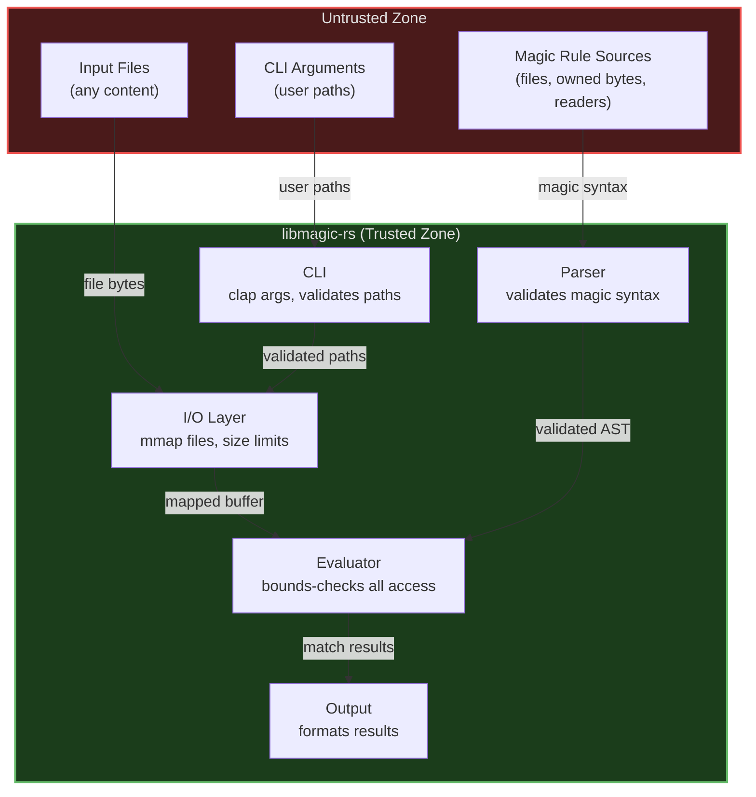

# Security Assurance Case

This document provides a structured argument that libmagic-rs meets its security requirements. It follows the assurance case model described in [NIST IR 7608](https://csrc.nist.gov/publications/detail/nistir/7608/final).

## 1. Security Requirements

libmagic-rs is a file type detection library and CLI tool. Its security requirements are:

1. **SR-1**: Must not crash, panic, or exhibit undefined behavior when processing any input file
2. **SR-2**: Must not crash, panic, or exhibit undefined behavior when parsing any magic file
3. **SR-3**: Must not read beyond allocated buffer boundaries
4. **SR-4**: Must not allow path traversal via CLI arguments
5. **SR-5**: Must not execute arbitrary code based on file contents or magic rule definitions
6. **SR-6**: Must not consume unbounded resources (memory, CPU) during evaluation
7. **SR-7**: Must not leak sensitive information from one file evaluation to another

## 2. Threat Model

### 2.1 Assets

- **Host system**: The machine running libmagic-rs
- **File contents**: Data being inspected (may be sensitive)
- **Magic rules**: Definitions that drive file type detection

### 2.2 Threat Actors

| Actor                       | Motivation                                                                 | Capability                            |
| --------------------------- | -------------------------------------------------------------------------- | ------------------------------------- |
| Malicious file author       | Exploit the detection tool to gain code execution or cause DoS             | Can craft arbitrary file contents     |
| Malicious magic file author | Inject rules that cause crashes, resource exhaustion, or incorrect results | Can craft arbitrary magic rule syntax |
| Supply chain attacker       | Compromise a dependency to inject malicious code                           | Can publish malicious crate versions  |

### 2.3 Attack Vectors

| ID   | Vector                                                       | Target SR  |
| ---- | ------------------------------------------------------------ | ---------- |
| AV-1 | Crafted file triggers buffer over-read                       | SR-1, SR-3 |
| AV-2 | Crafted file triggers integer overflow in offset calculation | SR-1, SR-3 |
| AV-3 | Deeply nested magic rules cause stack overflow               | SR-1, SR-6 |
| AV-4 | Extremely large file causes memory exhaustion                | SR-6       |
| AV-5 | Malformed magic file causes parser crash                     | SR-2       |
| AV-6 | CLI argument with path traversal reads unintended files      | SR-4       |
| AV-7 | Compromised dependency introduces unsafe code                | SR-5       |
| AV-8 | Caller-supplied reader stalls or trickles magic-rule input   | SR-6       |

## 3. Trust Boundaries

All data crossing the trust boundary (file contents, magic rule syntax, CLI arguments) is treated as untrusted and validated before use. Magic rules may be supplied as a filesystem path, as owned bytes, or through any `Read` implementation; every source enforces the same 1 GiB size bound and the same rejection of compiled binary `.mgc` input.

## 4. Secure Design Principles (Saltzer and Schroeder)

| Principle                       | How Applied                                                                                                                                                                                                                                                                                                                                                                                   |
| ------------------------------- | --------------------------------------------------------------------------------------------------------------------------------------------------------------------------------------------------------------------------------------------------------------------------------------------------------------------------------------------------------------------------------------------- |
| **Economy of mechanism**        | Pure Rust with minimal dependencies. Simple parser-evaluator pipeline. No plugin system, no scripting, no network I/O.                                                                                                                                                                                                                                                                        |
| **Fail-safe defaults**          | Workspace lint `unsafe_code = "deny"` enforced project-wide via `Cargo.toml` (one vetted, SAFETY-commented memmap2 exception in `src/io/mod.rs`). Buffer access defaults to bounds-checked `.get()` returning `None` rather than panicking; `clippy::indexing_slicing` enforces this, with invariant-documented allows at provably-safe sites. Invalid magic rules are skipped, not executed. |
| **Complete mediation**          | Every buffer access is bounds-checked. Every magic file is validated during parsing. Every CLI argument is validated by `clap`.                                                                                                                                                                                                                                                               |
| **Open design**                 | Fully open source (Apache-2.0). Security does not depend on obscurity. All security mechanisms are publicly documented.                                                                                                                                                                                                                                                                       |
| **Separation of privilege**     | Parser and evaluator are separate modules with distinct responsibilities. Parse errors cannot bypass evaluation safety checks.                                                                                                                                                                                                                                                                |
| **Least privilege**             | The tool only reads files; it never writes, executes, or modifies them. No network access. No elevated permissions required.                                                                                                                                                                                                                                                                  |
| **Least common mechanism**      | No shared mutable state between file evaluations. Each evaluation operates on its own data. No global caches that could leak information.                                                                                                                                                                                                                                                     |
| **Psychological acceptability** | CLI follows GNU `file` conventions. Error messages are descriptive and actionable. Default behavior is safe (built-in rules, no network).                                                                                                                                                                                                                                                     |

## 5. Common Weakness Countermeasures

### 5.1 CWE/SANS Top 25

| CWE     | Weakness                          | Countermeasure                                                                                                                                                                                                                                                                          | Status    |
| ------- | --------------------------------- | --------------------------------------------------------------------------------------------------------------------------------------------------------------------------------------------------------------------------------------------------------------------------------------- | --------- |
| CWE-787 | Out-of-bounds write               | Rust ownership prevents writes to unowned memory. Workspace-level lints in `Cargo.toml` deny unsafe code (single vetted read-only memmap2 exception) and eliminate raw pointer writes.                                                                                                  | Mitigated |
| CWE-79  | XSS                               | Not applicable (no web output).                                                                                                                                                                                                                                                         | N/A       |
| CWE-89  | SQL injection                     | Not applicable (no database).                                                                                                                                                                                                                                                           | N/A       |
| CWE-416 | Use after free                    | Rust ownership/borrowing system prevents use-after-free at compile time.                                                                                                                                                                                                                | Mitigated |
| CWE-78  | OS command injection              | No shell invocation or command execution. CLI arguments parsed by `clap`, not passed to shell.                                                                                                                                                                                          | Mitigated |
| CWE-20  | Improper input validation         | All inputs validated: magic syntax validated by parser, file buffers bounds-checked, CLI args validated by `clap`.                                                                                                                                                                      | Mitigated |
| CWE-125 | Out-of-bounds read                | All buffer access uses `.get()` with bounds checking. Memory-mapped files have known size limits.                                                                                                                                                                                       | Mitigated |
| CWE-22  | Path traversal                    | CLI accepts file paths as arguments but only performs read-only access. No path construction from file contents.                                                                                                                                                                        | Mitigated |
| CWE-352 | CSRF                              | Not applicable (no web interface).                                                                                                                                                                                                                                                      | N/A       |
| CWE-434 | Unrestricted upload               | Not applicable (no file upload).                                                                                                                                                                                                                                                        | N/A       |
| CWE-476 | NULL pointer dereference          | Rust's `Option` type eliminates null pointer dereferences at compile time.                                                                                                                                                                                                              | Mitigated |
| CWE-190 | Integer overflow                  | Rust panics on integer overflow in debug builds. Offset calculations use checked arithmetic.                                                                                                                                                                                            | Mitigated |
| CWE-502 | Deserialization of untrusted data | Magic files are parsed with a strict grammar, not deserialized from arbitrary formats.                                                                                                                                                                                                  | Mitigated |
| CWE-400 | Resource exhaustion               | Evaluation timeouts prevent unbounded CPU use. Memory-mapped I/O avoids loading entire files into memory. `EvaluationConfig::max_string_length` caps scan-mode `TypeKind::String` allocations on both unflagged and flagged paths; see §7.3 for the `PString`/`String16` coverage gaps. | Mitigated |

### 5.2 OWASP Top 10 (where applicable)

Most OWASP Top 10 categories target web applications and are not applicable to a file detection library. The applicable items are:

| Category                   | Applicability                 | Countermeasure                                                           |
| -------------------------- | ----------------------------- | ------------------------------------------------------------------------ |
| A03: Injection             | Partial -- magic file parsing | Strict grammar-based parser rejects invalid syntax                       |
| A04: Insecure Design       | Applicable                    | Secure design principles applied throughout (see Section 4)              |
| A06: Vulnerable Components | Applicable                    | `cargo audit` daily, `cargo deny`, Dependabot, `cargo-auditable`         |
| A09: Security Logging      | Partial                       | Evaluation errors logged; security events reported via GitHub Advisories |

## 6. Supply Chain Security

| Measure             | Implementation                                                                    |
| ------------------- | --------------------------------------------------------------------------------- |
| Dependency auditing | `cargo audit` and `cargo deny` run daily in CI                                    |
| Dependency updates  | Dependabot configured for automated PRs                                           |
| Pinned toolchain    | Exact rustc version pinned in `mise.toml` / `mise.lock` for CI and builds         |
| Reproducible builds | `Cargo.lock` and `mise.lock` committed                                            |
| Build provenance    | Sigstore attestations via `actions/attest` (SHA-pinned via `dist-workspace.toml`) |
| SBOM generation     | `cargo-cyclonedx` produces CycloneDX SBOM per release                             |
| Binary auditing     | `cargo-auditable` embeds dependency metadata in binaries                          |
| CI integrity        | All GitHub Actions pinned to SHA hashes                                           |
| Code review         | Required on all PRs; automated by CodeRabbit with security-focused checks         |

## 7. Known Limitations and Residual Risk

### 7.1 Default Configuration Has No Timeout

`EvaluationConfig::default()` (and `EvaluationConfig::new()`) sets `timeout_ms: None`, meaning evaluation runs without a wall-clock limit. The other validated bounds (recursion depth, string length, resource combination) prevent stack overflow and unbounded memory growth, but they do not bound total CPU time. A maliciously crafted file or magic rule that stays within those bounds could still drive evaluation into a long-running state, resulting in a denial-of-service condition for callers that process untrusted input with the default configuration.

**Mitigation for callers:** When processing untrusted input, use `EvaluationConfig::performance()` (which sets a 1-second timeout) or set `timeout_ms` explicitly. The CLI exposes this as `--timeout-ms`. See [Configuration: Security Considerations](configuration.md#security-considerations) for details.

This behavior is documented in the development gotchas (`GOTCHAS.md` section 13.1, "`EvaluationConfig::default()` Has No Timeout") and is intentional: changing the default would silently break callers that legitimately need long-running evaluation on trusted input.

### 7.2 TOCTOU Window in `evaluate_file`

`MagicDatabase::evaluate_file` has a time-of-check/time-of-use (TOCTOU) window between path validation and memory mapping ([CWE-367](https://cwe.mitre.org/data/definitions/367.html)). The method calls `std::fs::metadata(path)` to handle the empty-file case, then opens and memory-maps the file via the I/O layer, which itself re-validates file metadata (regular file, size bounds) before calling the underlying `mmap`. Between these validation steps and the final mapping, the path may be swapped -- for example via a symlink replacement or rename -- by another process. The bytes that ultimately get mapped may therefore belong to a different file than the one that passed validation.

The I/O layer mitigates the common shapes of this attack by canonicalizing the path and rejecting non-regular file types (directories, FIFOs, sockets, block/character devices). The mapping is always read-only, so a successful race cannot corrupt the target file or the caller's process state. The residual risk is **incorrect classification**: `evaluate_file` may return a file-type description for a file other than the one the caller named.

**Mitigation for callers:** When processing untrusted paths in an adversarial environment, do not use `evaluate_file`. Instead:

1. Open the file yourself using a TOCTOU-aware I/O strategy appropriate to your platform -- e.g., `openat` with `O_NOFOLLOW`, or holding a single open file descriptor across validation and read.
2. Read the bytes into memory (bounded by your own size limit).
3. Pass the resulting `&[u8]` to `MagicDatabase::evaluate_buffer`, which has no filesystem interaction and therefore no TOCTOU window.

The `evaluate_file` rustdoc (`# Security` section) cross-references this subsection.

#### 7.2.1 CLI Symlink Precheck

The `rmagic` CLI classifies symlinks itself, before `evaluate_file` is reached (`src/cli/symlink.rs`). That precheck is three syscalls against the same path -- `lstat` (does it name a symlink), `readlink` (what does it store), then `stat` (is the target reachable) -- so it carries a TOCTOU window of its own, of the same shape as 7.2: the path may be swapped between any two of them. The residual risk is likewise **incorrect classification**, not memory unsafety; no file content is read on this path, and the link itself is never written or followed for anything but a reachability test.

Two properties are worth stating precisely, because it is easy to over-read the guarantee:

- **`--no-dereference` bounds content disclosure, not path access.** Under it, rmagic never reads or classifies the *content* of a link's target, so a planted link in an extracted archive cannot induce rmagic to describe an attacker-chosen file. This is the mitigation to reach for when scanning untrusted trees.
- **It does not mean the target is untouched.** The reachability probe is `fs::metadata(path)`, which follows the link and stats the target under *both* flag states. That stat is not bounded by `--timeout-ms`, which governs rule evaluation only, so a link pointing into an unresponsive network mount can still stall the scan regardless of the flag.

Symlink target text also reaches stdout, where it did not before -- a broken link previously produced no stdout line at all. Targets carry no character restrictions and may contain raw ESC or OSC bytes, which an interactive terminal would interpret (title spoofing, or OSC 52 clipboard writes that a later paste turns into command injection). Control bytes are therefore escaped when stdout is a terminal and passed through unchanged when it is redirected or piped, which keeps captured output byte-identical to GNU `file` while protecting the interactive case. See `docs/adr/0001-gnu-file-output-contract.md` for why that split does not breach the output contract.

**Mitigation for callers:** The library is unaffected -- `MagicDatabase::evaluate_file` still returns an I/O error for a broken symlink, and the 7.2 guidance (open the file yourself, pass bytes to `evaluate_buffer`) remains the TOCTOU-free path.

### 7.3 `max_string_length` Coverage Gaps

`EvaluationConfig::max_string_length` caps the buffer-length allocation for `TypeKind::String` scan-mode reads (both the unflagged `(None, _)` arm of `read_typed_value_with_pattern` and the flagged-string arm of `read_pattern_match`). It does **not** govern two adjacent string-family read paths:

- **`TypeKind::PString`** uses an explicit length prefix decoded from the buffer and returns `TypeReadError::BufferOverrun` (rather than truncating) when the prefix declares a length that exceeds the remaining buffer. The error-on-overrun behaviour is a real bound -- the read function cannot allocate past the buffer length -- but it differs from the configurable cap that `max_string_length` provides. See GOTCHAS S3.8 for the load-bearing pstring anchor-clamp invariant.
- **`TypeKind::String16`** is capped at a hardcoded `STRING16_MAX_UNITS = 8192` ceiling (2 bytes per UCS-2 unit, so up to 16 384 bytes per read). The configured cap is not consulted on this path.

**Mitigation for callers:** Embedders who need a configurable cap on `String16` or `PString` reads cannot rely on `EvaluationConfig::max_string_length` for those types today. The existing built-in bounds (16 KiB ceiling on String16, error-on-overrun on PString) constrain the worst-case allocation. A configurable cap for these paths is tracked as follow-up work; the threat model entry will be updated when it lands.

### 7.4 Caller-Supplied Readers Are Trusted to Terminate

`MagicDatabase::load_from_reader` accepts any `Read` implementation, including sockets and pipes whose other end is outside the caller's control. Memory is bounded -- the reader is wrapped in `Read::take` at the same 1 GiB limit applied to magic files, so an endless stream cannot exhaust memory -- but **time is not**. A reader that blocks, or that trickles bytes indefinitely without reaching end of input, will stall the load call for as long as it keeps making progress.

`EvaluationConfig::timeout_ms` does not help here: it bounds rule *evaluation*, which happens after loading completes. There is no load-phase timeout.

**Mitigation for callers:** Apply read timeouts, deadlines, or a length-limited wrapper to the reader before passing it in (for example `TcpStream::set_read_timeout`, or reading into a `Vec<u8>` under your own deadline and calling `load_from_bytes` instead). Treat a reader from an untrusted peer the same way you would treat any other unbounded network read.

## 8. Ongoing Assurance

This assurance case is maintained as a living document. It is updated when:

- New features introduce new attack surfaces
- New threat vectors are identified
- Dependencies change significantly
- Security incidents occur

The project maintains continuous assurance through automated CI checks (clippy, CodeQL, cargo audit, cargo deny) that run on every commit.
