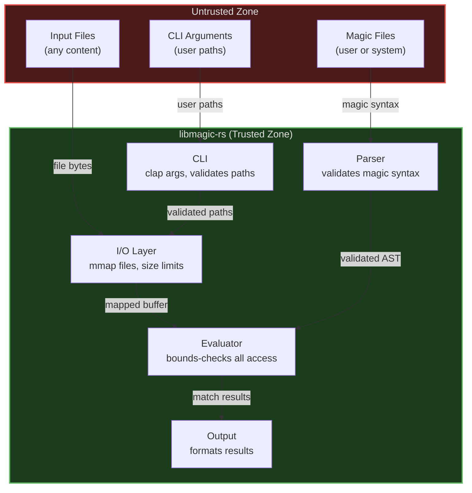

# Security Assurance Case

This document provides a structured argument that libmagic-rs meets its security requirements. It follows the assurance case model described in [NIST IR 7608](https://csrc.nist.gov/publications/detail/nistir/7608/final).

## 1. Security Requirements

libmagic-rs is a file type detection library and CLI tool. Its security requirements are:

1. **SR-1**: Must not crash, panic, or exhibit undefined behavior when processing any input file
2. **SR-2**: Must not crash, panic, or exhibit undefined behavior when parsing any magic file
3. **SR-3**: Must not read beyond allocated buffer boundaries
4. **SR-4**: Must not allow path traversal via CLI arguments
5. **SR-5**: Must not execute arbitrary code based on file contents or magic rule definitions
6. **SR-6**: Must not consume unbounded resources (memory, CPU) during evaluation
7. **SR-7**: Must not leak sensitive information from one file evaluation to another

## 2. Threat Model

### 2.1 Assets

- **Host system**: The machine running libmagic-rs
- **File contents**: Data being inspected (may be sensitive)
- **Magic rules**: Definitions that drive file type detection

### 2.2 Threat Actors

| Actor                       | Motivation                                                                 | Capability                            |
| --------------------------- | -------------------------------------------------------------------------- | ------------------------------------- |
| Malicious file author       | Exploit the detection tool to gain code execution or cause DoS             | Can craft arbitrary file contents     |
| Malicious magic file author | Inject rules that cause crashes, resource exhaustion, or incorrect results | Can craft arbitrary magic rule syntax |
| Supply chain attacker       | Compromise a dependency to inject malicious code                           | Can publish malicious crate versions  |

### 2.3 Attack Vectors

| ID   | Vector                                                       | Target SR  |
| ---- | ------------------------------------------------------------ | ---------- |
| AV-1 | Crafted file triggers buffer over-read                       | SR-1, SR-3 |
| AV-2 | Crafted file triggers integer overflow in offset calculation | SR-1, SR-3 |
| AV-3 | Deeply nested magic rules cause stack overflow               | SR-1, SR-6 |
| AV-4 | Extremely large file causes memory exhaustion                | SR-6       |
| AV-5 | Malformed magic file causes parser crash                     | SR-2       |
| AV-6 | CLI argument with path traversal reads unintended files      | SR-4       |
| AV-7 | Compromised dependency introduces unsafe code                | SR-5       |

## 3. Trust Boundaries

All data crossing the trust boundary (file contents, magic file syntax, CLI arguments) is treated as untrusted and validated before use.

## 4. Secure Design Principles (Saltzer and Schroeder)

| Principle                       | How Applied                                                                                                                                                                                                              |
| ------------------------------- | ------------------------------------------------------------------------------------------------------------------------------------------------------------------------------------------------------------------------ |
| **Economy of mechanism**        | Pure Rust with minimal dependencies. Simple parser-evaluator pipeline. No plugin system, no scripting, no network I/O.                                                                                                   |
| **Fail-safe defaults**          | Workspace lint `unsafe_code = "forbid"` enforced project-wide via `Cargo.toml`. Buffer access defaults to bounds-checked `.get()` returning `None` rather than panicking. Invalid magic rules are skipped, not executed. |
| **Complete mediation**          | Every buffer access is bounds-checked. Every magic file is validated during parsing. Every CLI argument is validated by `clap`.                                                                                          |
| **Open design**                 | Fully open source (Apache-2.0). Security does not depend on obscurity. All security mechanisms are publicly documented.                                                                                                  |
| **Separation of privilege**     | Parser and evaluator are separate modules with distinct responsibilities. Parse errors cannot bypass evaluation safety checks.                                                                                           |
| **Least privilege**             | The tool only reads files; it never writes, executes, or modifies them. No network access. No elevated permissions required.                                                                                             |
| **Least common mechanism**      | No shared mutable state between file evaluations. Each evaluation operates on its own data. No global caches that could leak information.                                                                                |
| **Psychological acceptability** | CLI follows GNU `file` conventions. Error messages are descriptive and actionable. Default behavior is safe (built-in rules, no network).                                                                                |

## 5. Common Weakness Countermeasures

### 5.1 CWE/SANS Top 25

| CWE     | Weakness                          | Countermeasure                                                                                                                               | Status    |
| ------- | --------------------------------- | -------------------------------------------------------------------------------------------------------------------------------------------- | --------- |
| CWE-787 | Out-of-bounds write               | Rust ownership prevents writes to unowned memory. Workspace-level lints in `Cargo.toml` forbid unsafe code and eliminate raw pointer writes. | Mitigated |
| CWE-79  | XSS                               | Not applicable (no web output).                                                                                                              | N/A       |
| CWE-89  | SQL injection                     | Not applicable (no database).                                                                                                                | N/A       |
| CWE-416 | Use after free                    | Rust ownership/borrowing system prevents use-after-free at compile time.                                                                     | Mitigated |
| CWE-78  | OS command injection              | No shell invocation or command execution. CLI arguments parsed by `clap`, not passed to shell.                                               | Mitigated |
| CWE-20  | Improper input validation         | All inputs validated: magic syntax validated by parser, file buffers bounds-checked, CLI args validated by `clap`.                           | Mitigated |
| CWE-125 | Out-of-bounds read                | All buffer access uses `.get()` with bounds checking. Memory-mapped files have known size limits.                                            | Mitigated |
| CWE-22  | Path traversal                    | CLI accepts file paths as arguments but only performs read-only access. No path construction from file contents.                             | Mitigated |
| CWE-352 | CSRF                              | Not applicable (no web interface).                                                                                                           | N/A       |
| CWE-434 | Unrestricted upload               | Not applicable (no file upload).                                                                                                             | N/A       |
| CWE-476 | NULL pointer dereference          | Rust's `Option` type eliminates null pointer dereferences at compile time.                                                                   | Mitigated |
| CWE-190 | Integer overflow                  | Rust panics on integer overflow in debug builds. Offset calculations use checked arithmetic.                                                 | Mitigated |
| CWE-502 | Deserialization of untrusted data | Magic files are parsed with a strict grammar, not deserialized from arbitrary formats.                                                       | Mitigated |
| CWE-400 | Resource exhaustion               | Evaluation timeouts prevent unbounded CPU use. Memory-mapped I/O avoids loading entire files into memory.                                    | Mitigated |

### 5.2 OWASP Top 10 (where applicable)

Most OWASP Top 10 categories target web applications and are not applicable to a file detection library. The applicable items are:

| Category                   | Applicability                 | Countermeasure                                                           |
| -------------------------- | ----------------------------- | ------------------------------------------------------------------------ |
| A03: Injection             | Partial -- magic file parsing | Strict grammar-based parser rejects invalid syntax                       |
| A04: Insecure Design       | Applicable                    | Secure design principles applied throughout (see Section 4)              |
| A06: Vulnerable Components | Applicable                    | `cargo audit` daily, `cargo deny`, Dependabot, `cargo-auditable`         |
| A09: Security Logging      | Partial                       | Evaluation errors logged; security events reported via GitHub Advisories |

## 6. Supply Chain Security

| Measure             | Implementation                                                                                |
| ------------------- | --------------------------------------------------------------------------------------------- |
| Dependency auditing | `cargo audit` and `cargo deny` run daily in CI                                                |
| Dependency updates  | Dependabot configured for automated PRs                                                       |
| Pinned toolchain    | Rust stable via `rust-toolchain.toml`                                                         |
| Reproducible builds | `Cargo.lock` and `mise.lock` committed                                                        |
| Build provenance    | Sigstore attestations via `actions/attest-build-provenance` (wrapper around `actions/attest`) |
| SBOM generation     | `cargo-cyclonedx` produces CycloneDX SBOM per release                                         |
| Binary auditing     | `cargo-auditable` embeds dependency metadata in binaries                                      |
| CI integrity        | All GitHub Actions pinned to SHA hashes                                                       |
| Code review         | Required on all PRs; automated by CodeRabbit with security-focused checks                     |

## 7. Ongoing Assurance

This assurance case is maintained as a living document. It is updated when:

- New features introduce new attack surfaces
- New threat vectors are identified
- Dependencies change significantly
- Security incidents occur

The project maintains continuous assurance through automated CI checks (clippy, CodeQL, cargo audit, cargo deny) that run on every commit.
